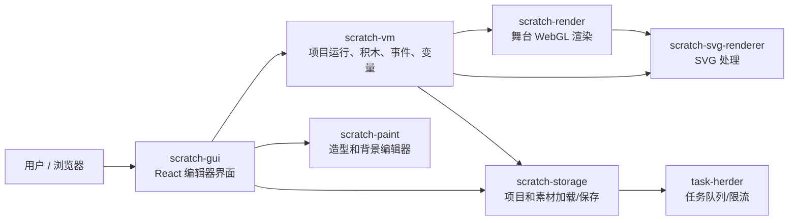
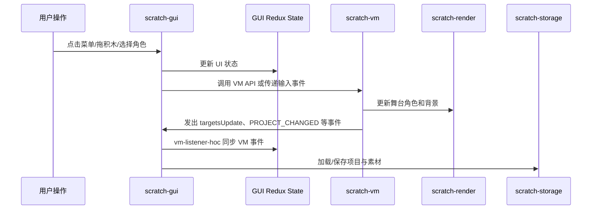

# Monorepo 架构总览

`scratch-editor` 是一个 npm workspaces monorepo。它把 Scratch 编辑器相关包放在同一个仓库中开发，但每个包仍然保留自己的 `package.json`、构建脚本和测试方式。

## 包关系地图



## 根目录的角色

根目录主要负责 workspace 管理：

- `package.json`：声明 workspaces 和全仓库脚本。
- `package-lock.json`：锁定所有包的依赖版本。
- `packages/`：真正的业务包。
- `scripts/`：monorepo 级别脚本。
- `AGENTS.md`：给 AI/自动化协作者看的项目约定。

常用根脚本：

```powershell
npm start
npm run build
npm test
npm run clean
```

其中 `npm start` 实际执行的是：

```powershell
npm --workspace @scratch/scratch-gui start
```

也就是启动 `scratch-gui` 的 webpack dev server。

## packages 一览

| 包 | 你可以怎么理解 | 主要技术 |
| - | - | - |
| `scratch-gui` | 编辑器前端外壳，负责把所有功能组织成用户界面 | React、Redux、webpack |
| `scratch-vm` | Scratch 项目的“运行时大脑” | JavaScript、事件系统、webpack |
| `scratch-render` | 舞台渲染，负责把角色和背景画出来 | WebGL、JavaScript |
| `scratch-svg-renderer` | SVG 造型处理 | JavaScript |
| `scratch-paint` | 造型/背景编辑器 | React、绘图相关逻辑 |
| `scratch-storage` | 项目和素材存取 | TypeScript、webpack |
| `task-herder` | 任务队列工具 | TypeScript、Vite |
| `scratch-media-lib-scripts` | 媒体库构建脚本 | JavaScript |

## 运行时数据流



## 为什么刚克隆后要先构建内部包

这个仓库里的包是源码状态，不是 npm 发布后的成品包。`scratch-gui` 会引用这些内部包的构建产物，例如：

- `@scratch/scratch-storage/dist/web`
- `@scratch/scratch-vm/dist/web`
- `@scratch/scratch-render/dist/web`
- `@scratch/scratch-svg-renderer/dist/web`

所以第一次运行 GUI 前，通常要先构建内部依赖包。具体命令见 [本地开发运行手册](./04-local-dev-runbook.md)。

## 类比 GitDiagram / DeepWiki / Gitingest

你可以把这组文档当作本仓库的本地版学习资料：

- GitDiagram 类似内容：本文件的包关系图和运行时数据流。
- DeepWiki 类似内容：各文档对模块职责、入口文件和改动路径的解释。
- Gitingest 类似内容：关键目录和关键文件的索引，但不复制全量源码。

