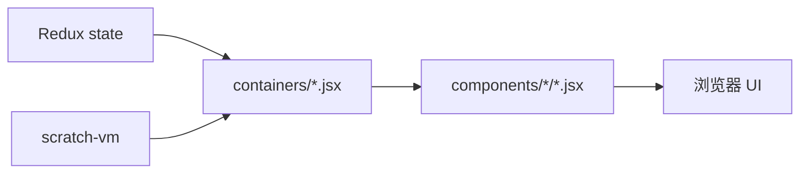

# scratch-gui 前端导读

`scratch-gui` 是你改前端页面时最常待的包。它不是普通后台管理系统，而是一个复杂编辑器：左边是积木编辑区，中间/右边是舞台、角色、声音、造型和素材库，背后还有 VM、渲染器和存储系统。

## 先看入口

| 文件 | 作用 |
| - | - |
| `packages/scratch-gui/src/playground/index.jsx` | 本地开发页面入口，`npm start` 跑起来后用它渲染 GUI |
| `packages/scratch-gui/src/index.ts` | 对外导出 GUI、初始状态、HOC 等 |
| `packages/scratch-gui/src/containers/gui.jsx` | GUI 容器层，连接 Redux、VM、storage、HOC |
| `packages/scratch-gui/src/components/gui/gui.jsx` | 真正的编辑器布局组件 |
| `packages/scratch-gui/src/components/gui/gui.css` | 主编辑器布局样式 |

## 目录怎么读

| 目录 | 作用 | 修改建议 |
| - | - | - |
| `src/components/` | 展示组件，偏 UI | 改视觉、布局、按钮、弹窗时优先看 |
| `src/containers/` | 容器组件，连接 Redux、VM 或副作用 | 需要拿状态、dispatch action、调用 VM 时看 |
| `src/reducers/` | Redux 状态切片 | 新增可共享 UI 状态、弹窗开关、模式时看 |
| `src/lib/` | 工具、HOC、资源配置、素材库 | 接入业务、配置、项目加载保存时常看 |
| `src/css/` | 全局颜色、单位、z-index 等变量 | 改主题和基础视觉规范时看 |
| `src/playground/` | 本地开发调试入口 | 改本地 demo 或调试参数时看 |

## components 和 containers 的区别

这个项目沿用 React 里常见的 presentational/container 分层。



粗略判断：

- 如果你只改显示效果，通常改 `components`。
- 如果你需要读取状态、dispatch action、调用 VM，通常改 `containers`。
- 如果多个地方都要共享一个 UI 状态，再考虑加 `reducers`。

## 主页面布局

主布局在 `src/components/gui/gui.jsx`：

- `MenuBar`：顶部菜单栏。
- `Tabs`：代码、造型、声音三个主 tab。
- `Blocks`：积木编辑区。
- `CostumeTab`：造型/背景编辑。
- `SoundTab`：声音编辑。
- `StageWrapper`：舞台。
- `TargetPane`：角色和舞台选择区域。
- `Backpack`：背包。
- `Alerts`、`ConnectionModal`、`TelemetryModal` 等：全局提示和弹窗。

对应样式在 `src/components/gui/gui.css`。这个 CSS 控制两列布局：编辑区一列，舞台和角色区一列。

## 顶部菜单

顶部菜单入口：

```text
packages/scratch-gui/src/components/menu-bar/menu-bar.jsx
```

常见子模块：

- `file-menu.jsx`：新建、从电脑加载、保存到电脑等。
- `edit-menu.jsx`：编辑菜单。
- `settings-menu.jsx`：设置相关。
- `share-button.jsx`：分享按钮。
- `community-button.jsx`：查看作品页面/社区入口。
- `account-menu.jsx`：账号菜单。

如果公司产品需要加入口，例如“打开产品中心”“同步到公司云端”“选择课程项目”，这里通常是第一站。

## 状态树

根 reducer 在：

```text
packages/scratch-gui/src/reducers/gui.ts
```

常见状态切片：

| reducer | 作用 |
| - | - |
| `editor-tab` | 当前选中代码/造型/声音哪个 tab |
| `modals` | 弹窗开关 |
| `project-state` | 项目加载、保存、错误状态 |
| `project-title` | 项目标题 |
| `targets` | 舞台、角色、当前编辑对象 |
| `vm` | VM 实例 |
| `vm-status` | VM 运行状态 |
| `settings` | 主题、颜色模式等设置 |
| `dynamic-assets` | 外部传入的动态素材 |

## VM 如何进入 GUI

VM 的连接主要靠 HOC：

- `src/lib/vm-manager-hoc.jsx`：初始化 VM、加载项目、启动 VM。
- `src/lib/vm-listener-hoc.jsx`：监听 VM 事件并同步到 Redux。
- `src/lib/cloud-manager-hoc.jsx`：云变量相关连接。

你可以把 VM 理解成“编辑器内核”。GUI 不应该随便自己维护项目真相，项目运行和角色状态应尽量来自 VM。

## 公司服务接入点

`src/gui-config.ts` 定义了 GUI 的外部配置接口。它很重要。

重点接口：

- `GUIStorage.scratchStorage`：Scratch 素材和项目存储实例。
- `saveProject(...)`：保存项目。
- `saveProjectThumbnail(...)`：保存缩略图。
- `backpackStorage`：背包存储。
- `cloudVariables`：云变量服务。
- `setProjectHost(...)`、`setAssetHost(...)`、`setProjectToken(...)`：设置服务地址和鉴权信息。

如果公司产品有自己的项目库、素材库、账号系统、云端保存，这里通常比直接改 UI 更核心。

## 国际化规则

`scratch-gui` 使用 `react-intl`。

新增用户可见文案时，不要直接写死中文或英文。优先使用：

```jsx
<FormattedMessage
    id="gui.example.myMessage"
    defaultMessage="My message"
    description="Shown on the example button"
/>
```

改完文案后，按项目约定需要跑 i18n 提取脚本。具体脚本看 `packages/scratch-gui/package.json`。

## 样式规则

常见样式文件：

- 组件局部 CSS：`src/components/**/**.css`
- 全局变量：`src/css/colors.css`、`src/css/units.css`、`src/css/z-index.css`
- 主题相关：`src/lib/settings/theme/`
- 颜色模式：`src/lib/settings/color-mode/`

这个项目大量使用 CSS Modules。组件里通常会：

```js
import styles from './component.css';
```

然后使用：

```jsx
<div className={styles.someClass} />
```

