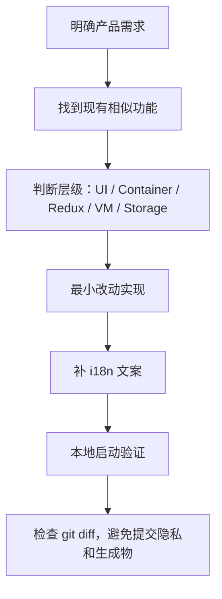

# 公司产品改版作战手册

这份文档面向你的真实任务：基于 Scratch 编辑器改版前端页面，让它支持公司更多产品。

## 先别急着改代码

改这种大型编辑器，最危险的不是不会写 React，而是不知道改动属于哪一层。每个需求先问四个问题：

1. 这是纯 UI 改版，还是涉及项目加载/保存？
2. 这是 Scratch 编辑器能力，还是公司业务入口？
3. 这个状态只在一个组件内使用，还是多个模块都要知道？
4. 这个功能要影响 VM 运行，还是只影响 GUI 展示？

## 需求类型和落点

| 需求类型 | 推荐落点 | 说明 |
| - | - | - |
| 换品牌 logo、顶部入口 | `src/components/menu-bar/` | 先改展示层，再看是否需要容器传入回调 |
| 新增公司产品入口 | `menu-bar`、新 `modal` 或新页面容器 | 入口在菜单，业务面板可做成弹窗或侧栏 |
| 接入公司项目列表 | 新容器 + `gui-config.ts` 扩展或宿主 props | 不要把 API 直接散落在组件里 |
| 改保存到公司云端 | `gui-config.ts`、`legacy-storage.ts`、`project-state` | 保存是系统边界，优先走 storage/config |
| 增加素材库内容 | `src/lib/libraries/*.json` 或 `dynamic-assets` | 静态资源走 JSON，运行时注入走 dynamic assets |
| 支持多个产品模式 | `settings`/新 reducer/宿主 props | 不要用全局变量硬切 |
| 改编辑器整体布局 | `components/gui/gui.jsx` 和 `gui.css` | 这是主布局，不要顺手改 VM |
| 添加新硬件或积木 | `scratch-vm/src/extensions/` + GUI 扩展库 | VM 提供积木，GUI 提供入口和连接 UI |

## 推荐改版路径



## 常见公司产品接入方式

### 方式 1：宿主系统包一层 GUI

适合公司已有平台，只把 Scratch 编辑器作为一个页面嵌进去。

关注点：

- 用外层系统处理登录态。
- 通过 props/config 把用户、项目 ID、保存函数传进 GUI。
- 尽量少改 Scratch 内部 UI。

优点：和上游差异小，后续同步成本低。

### 方式 2：在 Scratch GUI 内加公司入口

适合公司希望编辑器里直接出现产品中心、课程、设备、素材库等入口。

关注点：

- 顶部菜单入口放 `components/menu-bar/`。
- 弹窗状态放 `reducers/modals.js`。
- 复杂业务 UI 新建 `components/company-*` 和 `containers/company-*`。
- API 调用不要直接塞进展示组件。

优点：用户体验更一体化。

风险：和 Scratch 原界面耦合更深，升级上游代码时冲突更多。

### 方式 3：定制素材库和扩展库

适合公司有自己的角色、背景、声音、硬件或课程资源。

静态素材：

- `src/lib/libraries/sprites.json`
- `src/lib/libraries/backdrops.json`
- `src/lib/libraries/costumes.json`
- `src/lib/libraries/sounds.json`

运行时注入：

- `src/reducers/dynamic-assets.js`
- `containers/gui.jsx` 接收 `dynamicAssets` prop

硬件/积木扩展：

- `packages/scratch-vm/src/extensions/`
- `packages/scratch-gui/src/lib/libraries/extensions/`

## 加一个公司弹窗的大致步骤

1. 在 `reducers/modals.js` 增加 modal key 和 open/close action。
2. 在 `components/` 下新建展示组件，例如 `company-product-modal/`。
3. 在 `containers/` 下新建容器组件，连接 Redux 或业务回调。
4. 在 `components/gui/gui.jsx` 合适位置挂载弹窗。
5. 在 `components/menu-bar/menu-bar.jsx` 增加入口按钮。
6. 使用 `FormattedMessage` 写文案。
7. 启动 `npm start` 验证。

## 加公司项目保存能力的大致步骤

优先不要直接在按钮里写 fetch。

推荐方向：

1. 看 `src/gui-config.ts` 的 `GUIStorage`。
2. 找 `src/lib/legacy-storage.ts` 当前怎么实现保存。
3. 找 `reducers/project-state` 里保存状态如何流转。
4. 让宿主系统提供公司保存函数，或实现新的 storage adapter。
5. UI 层只关心“保存中、保存成功、保存失败”。

## 改版时容易踩的坑

- 不要把公司 token、内部域名、个人路径提交到公开 fork。
- 不要绕过 `react-intl` 直接写用户可见文案。
- 不要在展示组件里写复杂 API 请求。
- 不要把 VM 的项目状态复制一份到 GUI 状态里长期维护。
- 不要大面积格式化旧文件，后续同步上游会很痛。
- 不要一开始就改 `scratch-vm`，除非需求真的涉及积木、运行时、角色状态或扩展。

## 每次提交前检查

```powershell
git status
git diff --cached
```

重点确认：

- 没有 `.env`、token、账号、公司内部地址。
- 没有把 `node_modules`、`dist`、日志文件加进去。
- 改动集中在本次需求相关文件。
- 文案使用了 `FormattedMessage`。

