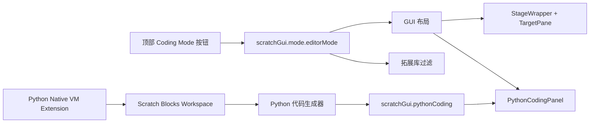

# Python 编码模式开发方案

本文记录 `scratch-editor` 第一版 Python 编码模式的实现方案和代码落点。

这次目标不是一次性做完整 Python IDE，而是先完成一个可验证的 MVP：

- 左侧仍然保留 Scratch 积木区。
- 右侧舞台区可以切换成 Python 代码区。
- 拖动或修改积木后，右侧自动生成 Python 示例代码。
- 右侧包含上方代码显示区和下方控制台显示区。
- Python 拓展只在编码模式下出现在拓展库。
- 第一批 Python 积木只使用 Python 原生库示例，不连接硬件。

## 入口文件

### 顶部切换按钮

顶部按钮放在 Hello Scratch 按钮旁边：

```text
packages/scratch-gui/src/components/menu-bar/menu-bar.jsx
```

模式状态放在：

```text
packages/scratch-gui/src/reducers/mode.js
```

`mode.js` 原来已经管理播放器模式和全屏状态，所以第一版把 `editorMode` 放在这里最直接。

当前支持两个值：

```text
scratch
python
```

默认值是：

```text
scratch
```

### 右侧区域替换

普通 Scratch 编辑器右侧舞台和角色面板在这里渲染：

```text
packages/scratch-gui/src/components/gui/gui.jsx
```

原来的结构可以理解成：

```jsx
<StageWrapper />
<TargetPane />
```

Python 编码模式下，第一版直接替换整个右侧区域：

```jsx
{editorMode === 'python' ? (
    <PythonCodingPanel />
) : (
    <>
        <StageWrapper />
        <TargetPane />
    </>
)}
```

这样做的原因是：参考竞品图里，右侧不再需要舞台和角色列表，而是完整的代码区加控制台。如果只替换舞台画布，下面还会残留角色面板，交互形态会很怪。

### Python 面板

Python 代码面板新增在：

```text
packages/scratch-gui/src/components/python-coding-panel/
```

第一版结构：

```text
上方：生成的 Python 代码
下方：控制台输出
```

现在使用只读 `<textarea>`。等数据流稳定后，可以再升级成 CodeMirror 6 或 Monaco。

## 数据流



新增的 Redux 状态有两部分。

### `scratchGui.mode.editorMode`

控制当前编辑器模式：

```js
{
    editorMode: 'scratch'
}
```

### `scratchGui.pythonCoding`

保存右侧代码区和控制台内容：

```js
{
    code: '',
    consoleText: ''
}
```

第一版先全局保存生成代码。后续如果要做到“每个角色一份 Python 代码”，可以把这部分状态移动到角色或 target 维度。

## 拓展库过滤

拓展卡片定义在：

```text
packages/scratch-gui/src/lib/libraries/extensions/index.jsx
```

拓展库弹窗容器在：

```text
packages/scratch-gui/src/containers/extension-library.jsx
```

新增 Python 拓展卡片时加上 `modes`：

```js
{
    extensionId: 'pythonNative',
    modes: ['python']
}
```

拓展库渲染前根据当前 `editorMode` 过滤：

```js
!extension.modes || extension.modes.includes(editorMode)
```

这样普通 Scratch 模式不显示 Python 拓展，切到 Python 编码模式后才显示。

## Python VM 拓展

新增内置 VM 拓展：

```text
packages/scratch-vm/src/extensions/scratch3_python_native/index.js
```

注册位置：

```text
packages/scratch-vm/src/extension-support/extension-manager.js
```

第一批积木：

```text
print [TEXT]
sleep [SECS] seconds
random integer from [A] to [B]
current time
set [NAME] to [VALUE]
variable [NAME]
[A] [OP] [B]
join [A] and [B]
number [VALUE]
string [VALUE]
list [A] [B] [C]
length of [VALUE]
if [CONDITION]
for [VAR] in range [START] to [STOP]
```

这些积木现在可以作为 Scratch VM 拓展正常加载。它们的主要价值是给代码生成器提供稳定 opcode。

## Python 代码生成

仓库里没有现成 Python generator，所以第一版新增一个轻量公司自有生成器：

```text
packages/scratch-gui/src/lib/python-codegen/
```

生成过程：

1. 读取当前 Blockly workspace。
2. 找到顶层积木。
3. 通过 `getNextBlock()` 遍历一串积木。
4. 把已知 opcode 转成 Python 代码。
5. 遇到暂不支持的积木，生成注释提醒。

当前映射示例：

```text
pythonNative_print -> print("hello")
pythonNative_sleep -> time.sleep(1)
pythonNative_randomInteger -> random.randint(1, 10)
pythonNative_currentTime -> time.strftime("%H:%M:%S")
pythonNative_setVariable -> x = "0"
pythonNative_arithmetic -> (1 + 2)
pythonNative_compare -> ("1" == "1")
pythonNative_ifThen -> if condition:
pythonNative_forRange -> for i in range(0, 5):
```

如果使用绿色旗子事件作为顶层入口，会生成类似：

```python
def start_main():
    print("hello python")

start_main()
```

当前代码生成在这里触发：

```text
packages/scratch-gui/src/containers/blocks.jsx
```

触发时机：

- workspace 发生变化。
- 切换到 Python 编码模式。
- 当前角色 workspace 重新加载。

## 执行策略

### 第一阶段

只生成并显示 Python 代码。

控制台显示 Python Native 积木执行日志。代码生成只更新上方代码区，不写入控制台，避免拖动积木时刷屏。

```text
[print] hello python
[random] 7
```

### 第二阶段

如果要在浏览器里运行纯 Python，可以接 Pyodide，并捕获 `print()` 输出。

注意：Pyodide 会显著增加资源体积，需要单独评估加载策略。

### 第三阶段

如果要连接硬件或本地 Python 环境，建议走 Electron 主进程或本地后端服务。

不要把硬件控制能力、API Key、串口权限等敏感能力直接放在浏览器 UI 代码里。

## 本次实现清单

1. 新增本文档。
2. 新增 `editorMode` 状态和顶部模式切换按钮。
3. 新增 `PythonCodingPanel`。
4. Python 模式下替换右侧舞台和角色面板。
5. 新增 `pythonCoding` reducer。
6. 新增 Python Native VM 拓展。
7. 新增 Python 拓展库卡片。
8. 拓展库按模式过滤。
9. 新增轻量 Python 代码生成器。
10. 从 Blocks workspace 变化中触发代码生成。
11. 执行 i18n 提取和 GUI/VM 构建校验。

## 当前边界

- 代码生成器只支持 Python Native 拓展里的少量积木。
- 现在没有真正运行 Python，只是生成代码。
- 控制台暂时显示 Python Native 积木执行日志，还不承载真实 Python stdout。
- 暂不接硬件。
- 拓展 ID 和 opcode 会进入保存的项目文件，正式发布前要稳定命名。

## 后续建议

1. 先补更多 Python 原生库积木，例如数学、字符串、列表、时间。
2. 再决定是否接 Pyodide，用于浏览器内运行代码。
3. 如果公司产品要连接硬件，优先设计 Electron 主进程通信层。
4. 把 Python 模式的数据隔离到标签页或 target 维度，支持多个编辑器页面互不污染。
5. 给生成器补单元测试，避免 opcode 调整后生成代码悄悄失效。
