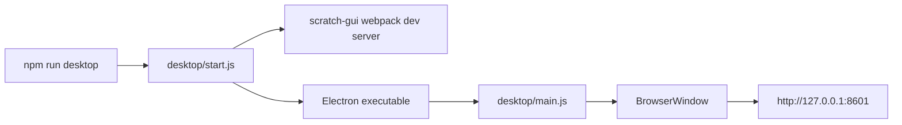

# Electron 桌面端运行方案

本文记录如何把当前 `scratch-editor` 从浏览器开发模式扩展到 Electron 桌面运行模式。

目标是先做一个可运行的桌面端 MVP：

- 继续复用当前 monorepo 里的 `@scratch/scratch-gui`。
- Electron 主进程负责创建桌面窗口。
- 渲染进程仍然加载现有 Scratch GUI 页面。
- 开发阶段先加载 `http://127.0.0.1:8601`。
- 后续再扩展离线打包、安装包和原生能力。

## 参考项目结论

参考项目：

```text
D:\code\scratch-desktop-3.32.0
```

它的核心结构是：

```text
src/main/index.js          Electron 主进程
src/renderer/index.js      Electron 渲染进程入口
webpack.main.js            主进程打包配置
webpack.renderer.js        渲染进程打包配置
scripts/start.js           开发启动脚本
electron-builder.yaml      安装包配置
```

`scratch-desktop` 的开发启动流程是：

```text
编译 main
  -> 编译 renderer
  -> 启动 Webpack Dev Server
  -> 启动 Electron
  -> BrowserWindow 加载 http://localhost:8601
```

当前 monorepo 已经有 `scratch-gui` 的 dev server：

```text
npm --workspace @scratch/scratch-gui start
```

所以第一版不需要复制完整 renderer 打包链路，只需要让 Electron 打开这个 dev server。

## 当前 MVP 架构



## 新增文件

```text
desktop/main.js
desktop/start.js
```

### `desktop/start.js`

职责：

1. 启动 `@scratch/scratch-gui` dev server。
2. 等待 `http://127.0.0.1:8601` 可访问。
3. 启动 Electron。
4. Electron 退出时关闭 dev server。

它只负责开发期运行，不负责打包安装包。

### `desktop/main.js`

职责：

1. 创建 `BrowserWindow`。
2. 加载 `SCRATCH_DESKTOP_URL` 指定的 GUI 地址。
3. 处理媒体权限请求。
4. 处理 `window.open` 外部链接。
5. 处理项目保存下载路径。
6. 提供常见 DevTools 快捷键。

## 根命令

新增命令：

```json
{
  "scripts": {
    "desktop": "node desktop/start.js"
  }
}
```

运行方式：

```powershell
npm run desktop
```

如果你已经自己启动了 GUI dev server，也可以跳过自动启动：

```powershell
$env:SCRATCH_DESKTOP_SKIP_GUI_SERVER='1'
npm run desktop
```

## 依赖

第一版只需要：

```text
electron
```

参考 `scratch-desktop-3.32.0`，版本先对齐 Electron 42：

```text
electron@42.0.1
```

当前仓库已经通过下面命令把依赖写入 `package.json` 和 `package-lock.json`：

```powershell
npm install --save-dev electron@42.0.1
```

如果换一台机器，只需要正常执行：

```powershell
npm install
```

## 和浏览器模式的关系

浏览器模式：

```text
npm start
```

桌面模式：

```text
npm run desktop
```

两者加载的是同一套 GUI 代码。区别只在外层容器：

```text
浏览器模式：Chrome / Edge 打开 dev server
桌面模式：Electron BrowserWindow 打开 dev server
```

## 当前边界

- 第一版只做开发期桌面运行。
- 暂不做 Windows / macOS / Linux 安装包。
- 暂不复制完整 `scratch-desktop` 的 renderer HOC、遥测、USB 弹窗和菜单系统。
- 暂不把本机 Python、硬件串口、文件系统能力暴露给 GUI。
- 后续如果要执行本机 Python，应通过 Electron 主进程 IPC 设计安全边界。

## 后续路线

1. 增加 `desktop:build:gui`，先生成本地 `packages/scratch-gui/build/index.html`。
2. 让 `desktop/main.js` 在生产模式加载本地 `file://`。
3. 增加 `electron-builder` 配置。
4. 把本机 Python 执行放到主进程或独立后端服务。
5. 设计 renderer 到 main 的 IPC 白名单，避免前端直接获得任意系统权限。
