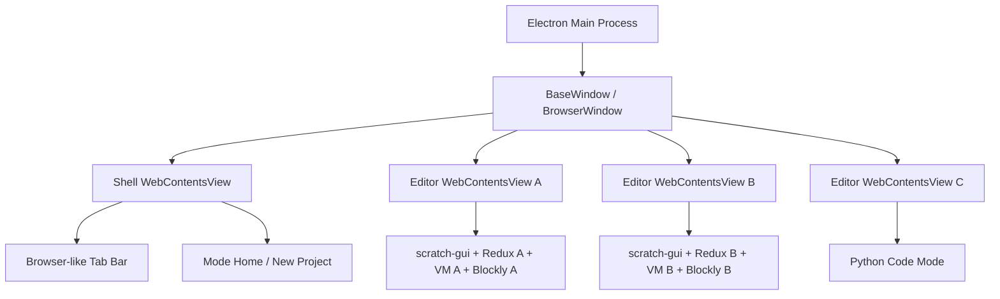
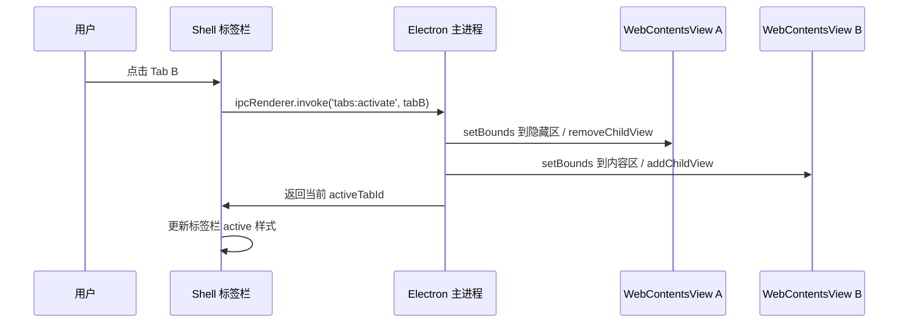
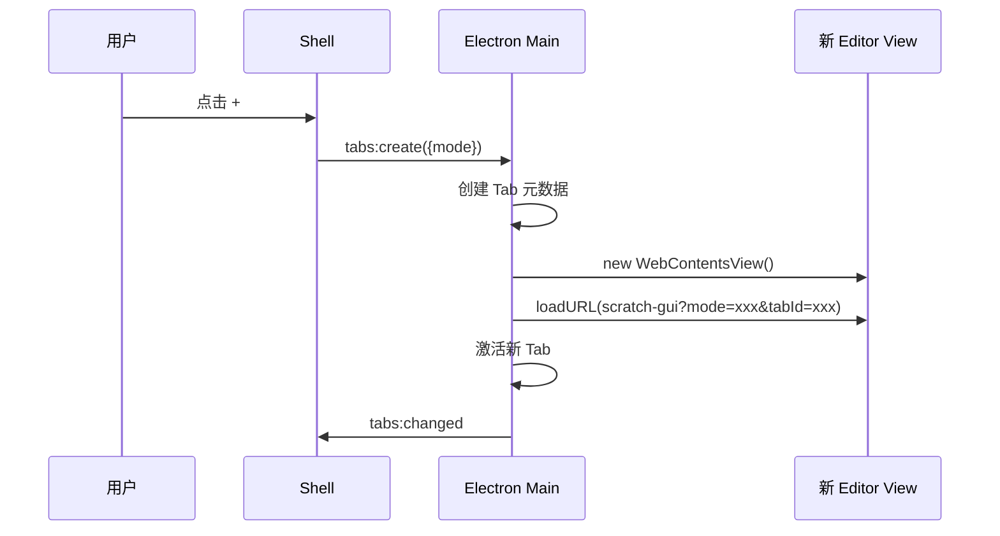

# 桌面端浏览器式多 Tab 功能调研与实现计划

## 目标

当前 `scratch-editor` 的桌面端运行方式是一个 Electron `BrowserWindow` 加载一个 `scratch-gui` 页面，所以同一时间只有一个编辑窗口。

竞品效果更像浏览器：

- 顶部第一行就是标签页栏。
- 标签页和最小化、最大化、关闭按钮在同一视觉高度。
- 可以新建、关闭、切换多个编辑项目。
- 切换标签页时编辑器数据不丢失，体验接近浏览器切换页面。
- 不同标签页可以是不同编辑器模式，例如 Scratch 积木、Python 编码、硬件上传模式等。

本文目标是先确定技术路线，不直接写代码。

## 联网调研结论

### Electron 标题栏能力

Electron 官方推荐用 `BrowserWindow` 的窗口定制能力实现自定义标题栏：

- `titleBarStyle: 'hidden'` 可以隐藏系统默认标题栏。
- Windows / Linux 下通常配合 `titleBarOverlay` 暴露原生最小化、最大化、关闭按钮。
- 自定义标题栏本质上仍然是渲染进程里的 HTML/CSS。
- 去掉默认标题栏后，需要用 CSS `app-region: drag` 指定可拖动窗口的区域。
- 标签、按钮、输入框这类可点击元素必须设置 `app-region: no-drag`，否则点击事件会被窗口拖拽区域吃掉。

参考资料：

- Electron Window Customization: https://www.electronjs.org/docs/latest/tutorial/window-customization
- Electron Custom Title Bar: https://www.electronjs.org/docs/latest/tutorial/custom-title-bar
- Electron Custom Window Interactions: https://www.electronjs.org/docs/latest/tutorial/custom-window-interactions

### Window Controls Overlay

`titleBarOverlay` 背后的思路接近 Web 的 Window Controls Overlay：页面内容可以延伸到标题栏区域，但必须避开系统窗口按钮。

在 Electron 里可以通过 `titleBarOverlay` 配置按钮区域高度和颜色。渲染层布局时要预留右侧窗口按钮区域，避免标签页或加号按钮被关闭按钮盖住。

参考资料：

- MDN Window Controls Overlay API: https://developer.mozilla.org/en-US/docs/Web/API/Window_Controls_Overlay_API

### 多 WebContents 的官方方向

Electron 新版本里，`BrowserView` 已经标记为 deprecated，官方推荐使用 `WebContentsView`。

`WebContentsView` 可以把多个独立页面挂在同一个窗口里。它很适合实现浏览器式多 Tab：每个 Tab 一个独立 `webContents`，切换时只显示当前 Tab 对应的 view。

参考资料：

- Electron WebContentsView: https://www.electronjs.org/docs/latest/api/web-contents-view
- Electron BrowserView Deprecated: https://www.electronjs.org/docs/latest/api/browser-view

## 核心判断

这个功能不要只理解成“顶部加几个按钮”。

它实际分成两层：

```text
桌面窗口外壳
  负责标题栏、标签栏、窗口按钮、Tab 生命周期、文件打开保存、IPC

编辑器内容实例
  每个 Tab 里运行一个 Scratch GUI / Python GUI / 其他编辑器模式
```

如果只在 `scratch-gui` 里加一个普通 React 标签栏，也能做出视觉效果，但很难做到浏览器式隔离。因为 Scratch GUI 内部有 Redux、VM、Blockly Workspace、渲染器、声音、资源缓存等状态。

真正接近竞品的实现，更像：

```text
一个 Electron 主窗口
  一个顶部 Shell 视图
  多个编辑器 WebContentsView
    Tab A: scratch-gui 实例 A
    Tab B: scratch-gui 实例 B
    Tab C: python 编辑器实例 C
```

用户提到竞品一个标签页约 150MB 内存。这个现象比较像“每个标签页一个独立 Chromium 渲染实例 / WebContents”，而不是单个 React 应用里只切换 Redux 数据。这个不是最终证据，但它是重要推测依据。

## 推荐方案

推荐采用“Electron 主进程管理多 WebContentsView，渲染层 Shell 画浏览器式标签栏”的方案。

### 架构图



### 职责划分

Electron 主进程负责：

- 创建主窗口。
- 配置隐藏标题栏和 `titleBarOverlay`。
- 创建、销毁、显示、隐藏每个 Tab 的 `WebContentsView`。
- 维护 Tab 元数据，例如 `id`、`title`、`mode`、`dirty`、`url`。
- 处理打开文件、保存文件、关闭前确认等系统能力。
- 提供受控 IPC，不把 Node 权限直接暴露给编辑器页面。

Shell 渲染层负责：

- 画顶部标签栏。
- 画首页 / 模式选择入口。
- 响应新建 Tab、关闭 Tab、切换 Tab、重命名 Tab。
- 显示 dirty 标记、加载中状态、崩溃状态。
- 通过 IPC 通知主进程切换实际编辑器 view。

`scratch-gui` 负责：

- 保持现有积木编辑器能力。
- 根据启动参数加载指定模式。
- 根据模式过滤扩展、工具栏和舞台 / 编码区。
- 不直接管理桌面窗口，不直接实现原生关闭按钮。

## 为什么不建议只在 `scratch-gui` 里做

可以做，但它更适合 Web 版 MVP，不适合作为长期桌面端方案。

### 单 React 应用多 GUI 实例

结构类似：

```jsx
<DesktopShell>
    <TabBar />
    {tabs.map(tab => (
        <ScratchGuiInstance
            key={tab.id}
            hidden={tab.id !== activeTabId}
        />
    ))}
</DesktopShell>
```

优点：

- 改动主要在前端。
- 不需要立刻引入 `WebContentsView`。
- 开发和调试更简单。

问题：

- `scratch-gui` 当前的 `AppStateHOC`、Redux store、VM 管理方式偏单实例。
- 多个完整 GUI 同时挂载在同一个页面里，容易互相影响全局事件、快捷键、拖拽、弹窗、扩展加载。
- 非激活 Tab 仍然可能占用动画、计时器、音频、WebGL 资源。
- 单个 renderer 崩溃会影响所有标签页。

### 单 GUI 切换项目数据

结构类似：

```text
切换 Tab
  保存当前项目快照
  卸载当前项目
  加载目标 Tab 项目
```

优点：

- 内存最低。
- 代码量看起来少。

问题：

- 不是真正的浏览器式切换。
- 切换速度依赖项目序列化和重新加载。
- Blockly 工作区滚动位置、撤销栈、当前选中对象、临时 UI 状态容易丢。
- 用户会明显感到“重新打开项目”，不是“切换标签页”。

所以它适合作为低内存降级策略，不适合作为主路线。

## Tab 数据模型

建议主进程保存轻量元数据，编辑器内部保存自己的重状态。

```js
{
    id: 'tab-uuid',
    title: '新建项目 - Python',
    mode: 'python-blocks',
    editorType: 'scratch-gui',
    url: 'http://127.0.0.1:8601/?desktopTabId=tab-uuid&mode=python-blocks',
    dirty: false,
    loading: false,
    crashed: false,
    filePath: null,
    createdAt: 1782290000000,
    updatedAt: 1782290000000
}
```

每个编辑器 view 内部自然拥有独立状态：

```text
Tab A
  WebContents A
  Redux Store A
  VM A
  Blockly Workspace A
  当前项目资源 A

Tab B
  WebContents B
  Redux Store B
  VM B
  Blockly Workspace B
  当前项目资源 B
```

这就是“每个编辑器标签页状态隔离”的核心。

## 标题栏和标签栏设计

### Electron 窗口配置

Windows / Linux 建议：

```js
new BrowserWindow({
    titleBarStyle: 'hidden',
    titleBarOverlay: {
        color: '#f3f3f3',
        symbolColor: '#222222',
        height: 36
    }
});
```

macOS 建议：

```js
new BrowserWindow({
    titleBarStyle: 'hiddenInset',
    trafficLightPosition: {x: 12, y: 10}
});
```

注意：如果后续用 `BaseWindow + WebContentsView`，窗口配置思路一样，但主窗口类型会从单一 `BrowserWindow` 过渡到更适合多 view 编排的窗口结构。

### CSS 拖拽区域

顶部空白区域可以拖动窗口：

```css
.desktop-titlebar {
    app-region: drag;
    user-select: none;
}
```

标签、关闭按钮、加号按钮、菜单按钮必须可点击：

```css
.tab,
.tab button,
.new-tab-button,
.home-button {
    app-region: no-drag;
}
```

这是桌面端标题栏最容易踩坑的点。某个按钮点不动时，第一反应应该检查它是否落在了 `app-region: drag` 区域里。

### 视觉结构

建议第一版结构：

```text
┌───────────────────────────────────────────────────────────────┐
│ Home │ [项目A ×] [项目B ×] [项目C ×] [+]          - □ ×       │
├───────────────────────────────────────────────────────────────┤
│ 菜单 / 工具栏 / 当前编辑器内容                                │
└───────────────────────────────────────────────────────────────┘
```

如果需要更像浏览器：

- 活跃 Tab 和下方内容区连在一起。
- 非活跃 Tab 使用浅灰背景。
- 关闭按钮 hover 后显示。
- 标签标题过长时中间省略。
- dirty 状态显示圆点或标题前标记。
- 加号按钮固定在最后一个标签后面。
- 右侧预留窗口控制按钮宽度，避免盖住标签。

## 切换标签页流程



为了切换流畅，第一版建议“不销毁非激活 Tab 的 WebContents”。只隐藏它，保留内存里的 Redux、VM 和 Blockly 状态。

## 新建标签页流程



如果用户从首页选择模式，则 `mode` 来自模式卡片。如果用户在已有编辑器里点击加号，则可以弹出模式选择菜单。

## 关闭标签页流程

关闭前要处理 dirty 状态：

```text
点击关闭
  如果 tab.dirty = false
    直接销毁 WebContentsView

  如果 tab.dirty = true
    弹窗：保存 / 不保存 / 取消
      保存：调用对应编辑器导出项目，再关闭
      不保存：销毁
      取消：保持当前状态
```

dirty 状态来源：

- `scratch-gui` 内部项目变化后通过 IPC 上报。
- Python 编码模式代码变化后通过 IPC 上报。
- 打开文件后保存成功则 dirty 置 false。

## 和当前仓库的落地关系

当前仓库已有：

```text
desktop/main.js
desktop/start.js
packages/scratch-gui
```

当前 `desktop/main.js` 是单窗口单页面：

```text
BrowserWindow
  loadURL(http://127.0.0.1:8601)
```

多 Tab 目标应演进成：

```text
Electron Desktop Shell
  titlebar + tabbar + home page

Editor Views
  scratch-gui view A
  scratch-gui view B
  python mode view C
```

建议新增一个桌面 Shell，而不是把所有桌面标签栏逻辑塞进现有 `scratch-gui`。

可选目录：

```text
desktop/
  main.js
  start.js
  preload.js
  shell/
    index.html
    src/
      app.jsx
      tab-bar.jsx
      home.jsx
      ipc-client.js
```

后续如果项目规模继续变大，可以把它升级成 workspace 包：

```text
packages/scratch-desktop-shell/
```

第一版为了少动 monorepo，可以先放在 `desktop/shell`。

## 实施阶段

### 阶段 1：标题栏 MVP

目标：把桌面端顶部改成真正可拖动的自定义标题栏。

工作：

- 修改 `desktop/main.js`，启用 `titleBarStyle` 和 `titleBarOverlay`。
- 新增 Shell 页面。
- Shell 顶部画 Home、一个默认 Tab、加号按钮。
- 做好 `app-region: drag` 和 `app-region: no-drag`。
- 先只加载一个编辑器 view，验证窗口按钮、拖动、点击都正常。

验收：

- Windows 下最小化、最大化、关闭按钮正常。
- 顶部空白处可拖动窗口。
- Tab、关闭按钮、加号按钮可以点击。
- 标签栏不会被右侧系统按钮盖住。

### 阶段 2：Tab 元数据和 IPC

目标：Shell 和主进程能维护真实 Tab 列表。

工作：

- 主进程建立 `tabs` map 和 `activeTabId`。
- 定义 IPC：
  - `tabs:list`
  - `tabs:create`
  - `tabs:activate`
  - `tabs:close`
  - `tabs:rename`
  - `tabs:setDirty`
- Shell 启动后从主进程读取 tabs。
- 主进程广播 `tabs:changed`。

验收：

- 点击加号能创建标签。
- 点击标签能切换 active 样式。
- 关闭标签能更新列表。
- 至少保留一个首页或一个默认标签。

### 阶段 3：多 WebContentsView 编辑器实例

目标：每个 Tab 对应一个独立编辑器页面。

工作：

- 每个 `tabs:create` 创建一个 `WebContentsView`。
- 每个 view 加载 `scratch-gui`，URL 带 `tabId` 和 `mode`。
- 切换 Tab 时显示目标 view，隐藏其他 view。
- 主窗口 resize 时重新设置当前 view bounds。
- 非激活 view 暂时保留，不销毁。

验收：

- Tab A 拖几个积木，切到 Tab B 再回来，积木仍在。
- Tab A 和 Tab B 的角色、积木、舞台状态互不影响。
- 切换不触发整页重新加载。

### 阶段 4：模式选择和不同编辑器类型

目标：加号不只是创建同一种 Scratch 页面，而是可以选择模式。

工作：

- Shell 首页展示模式选择。
- 模式配置集中管理：
  - `scratch-blocks`
  - `python-blocks`
  - `python-code`
  - `hardware-upload`
- `scratch-gui` 根据 `mode` 控制扩展库和布局。
- Python 编码模式可继续沿用已有舞台替换代码区的实现。

验收：

- 首页可以创建不同模式项目。
- 不同模式的扩展显示不同。
- 不同模式切换标签时状态不丢。

### 阶段 5：保存、恢复和关闭保护

目标：让多 Tab 能用于真实项目。

工作：

- 每个 Tab 记录 `filePath` 和 `dirty`。
- 编辑器变化时向主进程上报 dirty。
- 关闭 dirty Tab 时提示保存。
- 保存时调用对应编辑器导出逻辑。
- 应用退出时统一检查所有 dirty tabs。

验收：

- 修改后 Tab 标题有 dirty 标记。
- 保存后 dirty 标记消失。
- 关闭未保存项目时有确认弹窗。
- 取消关闭后 Tab 保持原状态。

### 阶段 6：性能和内存策略

目标：避免打开太多 Tab 后桌面端明显卡顿。

第一版策略：

- 默认最多允许同时打开 5 个编辑器 Tab。
- 超过数量时提示用户关闭旧 Tab。
- 非激活 Tab 保持内存，换取切换速度。

第二版策略：

- 支持 Tab 休眠。
- 休眠前让编辑器导出快照。
- 销毁对应 `WebContentsView`。
- 再次激活时重新创建 view 并恢复快照。

策略对比：

| 策略 | 切换速度 | 内存 | 状态完整度 | 实现难度 |
| - | - | - | - | - |
| 保留所有 WebContents | 最快 | 高 | 最好 | 中 |
| 单 GUI 切换项目 | 慢 | 低 | 一般 | 中 |
| WebContents 休眠恢复 | 中 | 中 | 较好 | 高 |

竞品如果每个 Tab 约 150MB，很可能第一版就是“保留每个 Tab 的独立 WebContents”。这是桌面软件里常见的空间换时间方案。

## 关键风险

### Scratch GUI 是否适合被多次加载

如果每个 Tab 是独立 `WebContentsView`，风险较低。因为每个 view 都是独立页面，Redux、VM、Blockly 都天然隔离。

如果在同一个 React 页面里挂多个 Scratch GUI，风险较高。全局事件、快捷键、拖拽层、弹窗层容易互相影响。

### WebGL 和音频资源

Scratch 舞台使用 WebGL，声音系统也会占资源。多个后台 Tab 同时活跃时，可能造成显存和 CPU 占用。

建议后续给非激活 Tab 增加暂停策略：

- 暂停 VM 运行。
- 静音或暂停声音。
- 降低舞台渲染频率。
- 必要时进入休眠。

### 标题栏点击区域

自定义标题栏最常见问题是按钮不可点击。原因通常是按钮落在 `app-region: drag` 区域里。

规范：

- 外层标题栏空白区域 `drag`。
- 所有交互控件 `no-drag`。
- 不在拖拽区域上做右键自定义菜单。

### 跨平台差异

Windows、macOS、Linux 的窗口按钮位置不完全一致。

需要分别验证：

- Windows 右侧三按钮。
- macOS 左侧红黄绿按钮。
- Linux 不同桌面环境下的标题栏行为。

## 推荐结论

如果目标是实现竞品那种浏览器式、流畅、多项目并存的体验，推荐路线是：

```text
Electron 自定义标题栏
  + Shell 标签栏
  + 每个 Tab 一个独立 WebContentsView
  + scratch-gui 作为编辑器内容页面
```

不要把这个功能完全塞进 `scratch-gui`。`scratch-gui` 应该继续负责编辑器本身，桌面端的 Tab、窗口、文件系统、关闭确认、应用生命周期应该交给 Electron Shell 管。

第一版可以先做 2 个 Tab 的 MVP：

```text
打开桌面端
  显示自定义标题栏
  默认创建 Tab A
  点击 + 创建 Tab B
  Tab A / Tab B 都是独立 scratch-gui
  来回切换积木不丢
```

这个 MVP 一旦跑通，后续再扩展首页模式选择、Python 编码模式、硬件上传模式，会更稳。

## 当前 MVP 落地记录

当前仓库已开始按本文方案落地第一版桌面多 Tab：

```text
desktop/main.js
  Electron 主进程
  创建自定义标题栏窗口
  创建 Shell WebContentsView
  创建多个编辑器 WebContentsView
  管理 tabs:create / tabs:activate / tabs:close

desktop/preload.js
  暴露安全的 tabs IPC API 给 Shell 页面

desktop/shell/index.html
desktop/shell/styles.css
desktop/shell/shell.js
  顶部浏览器式标签栏
  Home 按钮
  标签页列表
  新建标签页按钮
  关闭标签页按钮
```

第一版行为：

- 启动桌面端后自动创建一个 Scratch 编辑器 Tab。
- 点击 `+` 会创建新的 Scratch 编辑器 Tab。
- 点击标签页会切换当前显示的编辑器 `WebContentsView`。
- 关闭非最后一个标签页会销毁对应编辑器 view。
- 如果关闭到没有标签页，会自动补一个新的 Scratch Tab。
- 非激活 Tab 暂时不销毁，只移动到隐藏区域，因此编辑器状态理论上会保留。

当前还没有实现：

- dirty 状态上报。
- 关闭未保存项目确认。
- 首页模式选择。
- Python / 硬件模式的 Tab 创建入口。
- Tab 休眠和内存回收策略。

运行方式仍然是：

```powershell
npm run desktop
```

如果你已经手动启动了 `scratch-gui` dev server：

```powershell
$env:SCRATCH_DESKTOP_SKIP_GUI_SERVER='1'
npm run desktop
```
