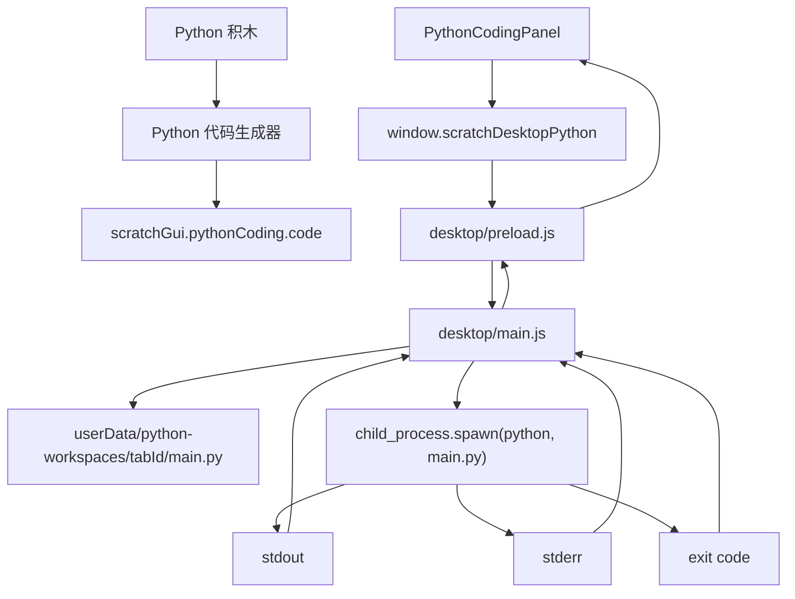

# 阶段 B：Python 文件生成与本机运行计划

本文是阶段 B 的实施前计划。

阶段 A 已经验证 Electron 桌面端可以打包运行。阶段 B 的目标是把当前“积木生成 Python 文本”的 Demo，推进到“生成 `.py` 文件并调用真实 Python 执行”。

本阶段先不做完整 VS Code Terminal。完整交互式终端放到阶段 C。

## 当前结论

推荐先做一个低风险闭环：

```text
Python 积木
  -> scratch-gui 生成 Python 代码文本
  -> Electron preload 暴露有限 API
  -> Electron main 为当前 Tab 创建工作目录
  -> 写入 main.py
  -> child_process.spawn 启动 Python
  -> stdout / stderr / exit code 回传到当前 Tab
  -> PythonCodingPanel 下方控制台显示真实运行结果
```

这个方案不依赖浏览器里的 Python 运行时，也不需要第一步就引入 `node-pty` 原生模块。

## 联网调研结论

### Electron 能力边界

Electron 官方推荐把系统能力放在主进程，通过 `ipcMain` / `ipcRenderer` 做进程通信，并用 `contextBridge` 在 preload 中暴露有限 API。

这和我们现在的桌面壳结构一致：

- `desktop/main.js` 管窗口、Tab、文件系统、子进程。
- `desktop/preload.js` 暴露安全 API 给页面。
- `packages/scratch-gui` 只调用 `window` 上的受控 API，不直接拿 Node 能力。

可行性判断：高。

参考：

- Electron IPC：<https://www.electronjs.org/docs/latest/tutorial/ipc>
- Electron Context Isolation：<https://www.electronjs.org/docs/latest/tutorial/context-isolation>
- Electron `app` API：<https://www.electronjs.org/docs/latest/api/app>

### Node 启动 Python

Node 官方 `child_process.spawn` 支持启动外部命令，并可读取 `stdout`、`stderr`、`close` 事件。

这适合阶段 B：

- 可以运行 `python main.py`。
- 可以实时拿到 `print()` 输出。
- 可以拿到异常堆栈。
- 可以拿到退出码。
- 可以在用户点击停止时 `kill()`。

限制是：普通 `spawn` 不是完整伪终端。它适合“运行脚本并看输出”，不适合完整交互式 shell。

可行性判断：高。

参考：

- Node.js `child_process`：<https://nodejs.org/api/child_process.html>

### Python 路径发现

Windows 上常见入口包括：

- `py -3`
- `python`
- `python3`
- 用户手动选择的 `python.exe`

macOS / Linux 常见入口包括：

- `python3`
- `python`
- 用户手动选择的 Python 路径

阶段 B 不建议立即内置 Python 解释器。先使用本机 Python，可以快速验证功能链路。后续商用再决定是否随安装包附带 Python。

可行性判断：中高。主要风险是用户机器没有 Python，或 PATH 指向错误版本。

参考：

- Python Windows 使用文档：<https://docs.python.org/3/using/windows.html>

### 打包后文件写入

Electron 打包后应用代码通常在 app 资源目录或 asar 中。生成的用户代码不能写回应用安装目录。

阶段 B 应该把每个 Tab 的临时代码写到用户数据目录，例如：

```text
app.getPath('userData')/python-workspaces/<tabId>/main.py
```

这样开发环境和打包环境都能工作。

可行性判断：高。

参考：

- Electron `app.getPath`：<https://www.electronjs.org/docs/latest/api/app>
- electron-builder 文件配置：<https://www.electron.build/configuration/contents>

### 终端方案

完整类 VS Code Terminal 通常需要两层：

- 前端显示层：`xterm.js`
- 后端伪终端：`node-pty`

`node-pty` 是原生模块，打包、重建、跨平台分发都会比普通 `spawn` 复杂。因此不建议阶段 B 直接上完整终端。

阶段 B 可以先把真实 stdout/stderr 接到现有 console 区域。阶段 C 再替换成 `xterm.js + node-pty`。

可行性判断：

- 阶段 B 输出控制台：高。
- 阶段 C 完整交互终端：中，需要专门处理原生模块打包。

参考：

- xterm.js：<https://xtermjs.org/docs/>
- node-pty：<https://github.com/microsoft/node-pty>

## 阶段 B 范围

### 做

1. 为每个桌面 Tab 建立 Python 工作目录。
2. 把当前生成的 Python 代码写入 `main.py`。
3. 在 Electron 主进程中运行本机 Python。
4. 捕获 stdout、stderr、exit code。
5. 将运行输出回传到对应编辑器 Tab。
6. Python 面板增加“运行”和“停止”能力。
7. 没有桌面 API 时，浏览器环境禁用运行按钮或显示提示。
8. 增加基础错误提示：没找到 Python、脚本运行失败、进程被停止。

### 暂不做

1. 不接硬件。
2. 不接串口、USB、烧录。
3. 不内置 Python 解释器。
4. 不做完整交互式 Terminal。
5. 不做项目格式保存恢复。
6. 不做 pip 依赖管理。
7. 不允许 Python 代码直接访问 Electron IPC。

## 推荐架构



## 代码落点

### Electron 主进程

文件：

```text
desktop/main.js
```

新增职责：

- 维护每个 Tab 的 Python 工作目录。
- 注册 Python IPC。
- 运行和停止 Python 进程。
- 根据 `webContents.id` 校验请求来源属于某个编辑器 Tab。
- 把运行输出只发送回请求的 Tab。

建议拆出文件：

```text
desktop/python-runner.js
```

职责：

- `resolvePythonCommand()`
- `createPythonWorkspace(tabId)`
- `writeMainFile(tabId, code)`
- `runPython(tabId, code, senderWebContents)`
- `stopPython(tabId)`
- `cleanupPythonWorkspace(tabId)`

如果第一版想保持改动更小，也可以先写在 `desktop/main.js`，等功能稳定再拆。

### Electron preload

文件：

```text
desktop/preload.js
```

新增 API：

```js
contextBridge.exposeInMainWorld("scratchDesktopPython", {
    run: (options) => ipcRenderer.invoke("python:run", options),
    stop: () => ipcRenderer.invoke("python:stop"),
    getStatus: () => ipcRenderer.invoke("python:status"),
    onOutput: (handler) => {
        const listener = (_event, payload) => handler(payload);
        ipcRenderer.on("python:output", listener);
        return () => ipcRenderer.removeListener("python:output", listener);
    },
    onExit: (handler) => {
        const listener = (_event, payload) => handler(payload);
        ipcRenderer.on("python:exit", listener);
        return () => ipcRenderer.removeListener("python:exit", listener);
    },
});
```

注意：不要暴露通用 `ipcRenderer.send` 或任意命令执行能力。

### scratch-gui 面板

文件：

```text
packages/scratch-gui/src/components/python-coding-panel/python-coding-panel.jsx
packages/scratch-gui/src/components/python-coding-panel/python-coding-panel.css
```

新增 UI：

- 运行按钮。
- 停止按钮。
- 运行状态文案。
- 当前脚本路径可选显示。
- 控制台继续使用当前 textarea，但显示真实 Python 输出。

第一版不强制接 `xterm.js`。

### scratch-gui 容器 / 状态

当前 `PythonCodingPanel` 是纯展示组件。阶段 B 需要给它接入行为。

可选方案：

#### 方案 A：在 GUI 组件中直接传回调

优点：

- 改动少。
- 适合阶段 B MVP。

缺点：

- GUI 组件会知道一点桌面 API。

#### 方案 B：新增 container

新增：

```text
packages/scratch-gui/src/containers/python-coding-panel.jsx
```

职责：

- 从 Redux 读取 code / console。
- 调用 `window.scratchDesktopPython.run()`。
- 监听 `python:output` / `python:exit`。
- dispatch 控制台输出。

优点：

- 组件职责清晰。
- 后续换 `xterm.js` 或做浏览器 fallback 更自然。

缺点：

- 多一个文件。

推荐方案 B。

### Redux

文件：

```text
packages/scratch-gui/src/reducers/python-coding.js
```

新增状态：

```js
{
    code: '',
    consoleText: '',
    isRunning: false,
    lastExitCode: null,
    scriptPath: null,
    error: null
}
```

新增 action：

- `setPythonRunning(isRunning)`
- `clearPythonConsole()`
- `setPythonScriptPath(scriptPath)`
- `setPythonExitCode(exitCode)`
- `setPythonError(error)`

## Python 运行设计

### 工作目录

每个 Tab 一个目录：

```text
<userData>/python-workspaces/<tabId>/
  main.py
```

优点：

- Tab 之间文件隔离。
- 运行时 cwd 清晰。
- 后续项目保存时可以把这个目录迁移成项目目录。

关闭 Tab 时可以删除临时目录。第一版也可以保留，便于调试。

### Python 发现策略

推荐优先级：

1. 用户配置的 Python 路径。
2. Windows：`py -3`。
3. 全平台：`python3`。
4. 全平台：`python`。

每个候选命令执行：

```text
--version
```

如果返回 0，则认为可用。

第一版可以先不做设置页，只做自动发现。没找到时给用户明确提示：

```text
未找到 Python。请安装 Python 3，或后续在设置中配置 Python 路径。
```

### 运行命令

Windows 优先：

```text
py -3 main.py
```

其他平台优先：

```text
python3 main.py
```

实际代码不要用字符串拼接 shell 命令。使用：

```js
spawn(command, args, {
    cwd: workspaceDir,
    shell: false,
});
```

这样能减少路径转义和命令注入风险。

### 输出格式

主进程回传事件：

```js
{
    tabId,
    stream: 'stdout',
    text: 'hello\n'
}
```

```js
{
    tabId,
    stream: 'stderr',
    text: 'Traceback ...'
}
```

退出事件：

```js
{
    tabId,
    exitCode: 0,
    signal: null
}
```

前端控制台显示：

```text
$ python main.py
hello scratch

[process exited with code 0]
```

## 安全边界

阶段 B 已经开始运行本机代码，安全边界必须提前定。

必须做：

1. GUI 不能直接调用 Node `child_process`。
2. preload 只能暴露固定 Python API。
3. 主进程只允许运行当前生成的 `main.py`。
4. 主进程写文件时路径必须限制在当前 Tab 工作目录。
5. `spawn` 不使用 `shell: true`。
6. Python 进程和 Tab 绑定，关闭 Tab 时停止进程。
7. 错误信息可以展示，但不要泄露过多内部路径给普通用户。开发阶段可以先保留。

暂时不能完全解决：

- 用户自己生成的 Python 代码本身可以读写本机文件。
- 如果未来开放任意 Python 输入，就需要项目级权限提示。
- 如果未来接硬件，需要单独做设备权限和独占锁。

## 实施步骤

### B1：桌面 Python IPC 骨架

目标：

- preload 暴露 `scratchDesktopPython`。
- main 注册 `python:run` / `python:stop`。
- 先返回固定响应，验证 GUI 能调用桌面 API。

验收：

```text
点击运行
  -> 控制台出现 [desktop] Python runner ready
```

### B2：工作目录与 main.py 写入

目标：

- 根据当前 Tab ID 创建工作目录。
- 把 Redux 里的 Python code 写入 `main.py`。
- 控制台打印脚本路径。

验收：

```text
点击运行
  -> userData/python-workspaces/<tabId>/main.py 存在
  -> 文件内容等于代码区内容
```

### B3：Python 自动发现

目标：

- 依次探测 `py -3`、`python3`、`python`。
- 找不到时给前端错误。

验收：

```text
有 Python：
  -> 控制台显示 Python 版本或运行命令

无 Python：
  -> 控制台显示未找到 Python 的错误提示
```

### B4：真实运行与输出回传

目标：

- `spawn` 运行 `main.py`。
- stdout/stderr 流式回传。
- exit code 回传。
- 运行中禁用运行按钮，启用停止按钮。

验收：

```text
拖 print block
生成 print("hello scratch")
点击运行
控制台显示 hello scratch
退出码为 0
```

### B5：停止与 Tab 生命周期

目标：

- 点击停止可以杀掉当前 Tab 的 Python 进程。
- 关闭 Tab 时自动停止对应进程。
- 多个 Tab 互不串输出。

验收：

```text
Tab A 运行 sleep
Tab B 运行 print
Tab B 输出不进入 Tab A
关闭 Tab A 后进程被停止
```

### B6：打包产物验证

目标：

- `npm run desktop:pack` 后运行 exe。
- 代码模式仍可写入 `main.py` 并运行 Python。

验收：

```text
桌面打包产物
  -> 首页创建代码模式
  -> 拖 print block
  -> 点击运行
  -> 控制台看到真实输出
```

## 人工测试清单

### 基础运行

1. 启动 `npm run desktop`。
2. 首页选择代码模式。
3. 添加 Python Native 扩展。
4. 拖 `print` 积木。
5. 输入 `hello scratch`。
6. 确认代码区生成 `print(...)`。
7. 点击运行。
8. 控制台显示真实输出。

### 错误输出

1. 临时制造语法错误。
2. 点击运行。
3. 控制台显示 Python traceback。
4. 退出码不是 0。

### 停止进程

1. 拖一个长时间 sleep 的积木。
2. 点击运行。
3. 点击停止。
4. 控制台显示进程已停止。
5. 再次运行可以正常启动。

### 多 Tab 隔离

1. 打开两个代码模式 Tab。
2. Tab A 输出 `A`。
3. Tab B 输出 `B`。
4. 两边控制台不串。
5. 关闭一个 Tab 不影响另一个 Tab。

### 打包验证

1. 运行 `npm run desktop:pack`。
2. 打开 `desktop-dist/win-unpacked/Scratch Editor.exe`。
3. 重复基础运行测试。

## 主要风险

| 风险                             | 影响           | 应对                                   |
| -------------------------------- | -------------- | -------------------------------------- |
| 用户未安装 Python                | 运行失败       | 自动发现失败时给清晰提示，后续加设置页 |
| PATH 指向 Python 2 或错误 Python | 运行结果异常   | 用 `--version` 检测 Python 3           |
| 打包后写文件路径错误             | exe 中运行失败 | 只写 `app.getPath('userData')`         |
| 多 Tab 输出串线                  | 用户看错结果   | 主进程用 tabId + webContents 双重绑定  |
| Python 死循环                    | 进程卡住       | 提供停止按钮，关闭 Tab 自动 kill       |
| 控制台还是 textarea              | 体验不像竞品   | 阶段 C 用 xterm.js + node-pty 替换     |
| node-pty 原生模块打包复杂        | 阶段延误       | 阶段 B 暂不引入 node-pty               |

## 是否需要内置 Python

阶段 B 不建议内置。

原因：

- 会增加安装包体积。
- Windows / macOS / Linux 三端都要处理不同解释器包。
- 后续 pip 包、权限、杀毒误报、签名都要一起考虑。
- 当前更重要的是验证“积木 -> 文件 -> 运行 -> 输出”的产品链路。

后续商用可选两种路线：

### 路线 1：使用用户本机 Python

优点：

- 安装包小。
- 实现快。
- 适合开发者或教学环境已有 Python 的场景。

缺点：

- 新手用户可能不会安装 Python。
- 环境差异较大。

### 路线 2：随软件附带 Python

优点：

- 用户开箱即用。
- 环境一致。

缺点：

- 安装包变大。
- 三端打包复杂。
- 需要考虑 Python 许可证、依赖包、升级策略。

推荐顺序：

```text
阶段 B：先用本机 Python
阶段 C/D 后：再评估是否内置 Python
```

## 与阶段 C 的关系

阶段 B 只要求真实运行和真实输出。

阶段 C 再做：

- `xterm.js` UI。
- `node-pty` 伪终端。
- stdin 输入。
- Ctrl+C。
- resize。
- shell session。
- 彩色输出。

这样阶段 B 可以尽快验证核心能力，阶段 C 再解决“像 VS Code Terminal”的体验。

## 审阅问题

实现前需要你确认三个问题：

1. 阶段 B 是否接受“先用本机 Python，不内置 Python”？
2. 阶段 B 是否接受“先用真实 stdout/stderr 控制台，不做完整 xterm terminal”？
3. Python 运行按钮放在 `PythonCodingPanel` 的代码区标题栏，是否符合你当前想要的交互？

如果这三个问题确认，就可以按 B1 到 B6 开始实现。

## 2026-06-29 实施记录

本轮已经按“阶段 B 先用本机 Python、先不做完整终端”的结论落地最小闭环。

### 已实现

1. 新增 `desktop/python-runner.js`，负责：
   - 为每个桌面 Tab 写入独立的 `main.py`；
   - 自动发现本机 Python；
   - 使用 `child_process.spawn` 运行脚本；
   - 捕获 `stdout`、`stderr`、退出码和停止信号；
   - Tab 关闭或窗口关闭时停止仍在运行的 Python 进程。
2. 更新 `desktop/main.js`：
   - 给编辑器 `WebContentsView` 注入 `desktop/preload.js`；
   - 建立 `webContents.id -> tabId` 映射；
   - 注册 `python:run`、`python:stop`、`python:status` IPC；
   - 校验 Python 请求必须来自编辑器 Tab，避免首页或标题栏页面调用运行能力。
3. 更新 `desktop/preload.js`：
   - 暴露受限的 `window.scratchDesktopPython` API；
   - 只提供运行、停止、状态查询和输出监听，不暴露通用 Node 能力。
4. 更新 `scratch-gui` Python 编码面板：
   - 新增容器 `packages/scratch-gui/src/containers/python-coding-panel.jsx`；
   - 从 Redux 读取生成的 Python 代码；
   - 点击 **Run** 后调用桌面端 API；
   - 将真实 Python 输出写入控制台区域；
   - 支持 **Stop** 和 **Clear**；
   - 显示运行状态、脚本路径、退出码和错误。
5. 更新 `packages/scratch-gui/src/reducers/python-coding.js`：
   - 增加 `isRunning`、`scriptPath`、`lastExitCode`、`error`；
   - 增加清空控制台、设置运行状态、脚本路径、退出码和错误的 action。
6. 优化 Python 编码模式入口：
   - 默认加载 Python 原生拓展；
   - 左侧工具箱只保留 Python 分类；
   - 隐藏造型、声音和书包等 Scratch 舞台模式 UI。

### 本轮仍然不是完整终端

当前控制台已经是真实 Python 输出，但还不是 VS Code 那种交互式 Terminal。

当前版本适合：

- 运行积木生成的 Python 脚本；
- 查看 `print()` 输出；
- 查看异常堆栈；
- 查看退出码；
- 手动停止正在运行的脚本。

当前版本暂不支持：

- 在控制台输入命令；
- `input()` 交互；
- pip 依赖管理；
- Python 虚拟环境选择；
- 内置 Python 解释器；
- 使用 `xterm.js + node-pty` 的完整伪终端。

这些能力归入阶段 C。

### Python 发现策略

当前自动尝试顺序：

1. `SCRATCH_DESKTOP_PYTHON` 环境变量；
2. Windows：`py -3`；
3. `python3`；
4. `python`。

如果机器没有可用 Python，会在面板控制台显示启动失败。

### 人工验证清单

1. 运行桌面端：

```powershell
fnm use 24
npm run desktop
```

2. 在首页新建 **代码模式** Tab。
3. 确认左侧工具箱默认只显示 Python 分类。
4. 拖入一个 `print` 积木，并确认右侧代码区出现 Python 代码。
5. 点击代码区头部 **Run**。
6. 预期结果：
   - 控制台出现脚本路径；
   - 控制台出现 `print()` 输出；
   - 运行结束后状态显示退出码 `0`。
7. 再拖入会报错的语句，点击 **Run**。
8. 预期结果：
   - 控制台显示 Python traceback；
   - 运行结束后显示非 `0` 退出码。
9. 拖入 `sleep` 之类较慢的脚本，点击 **Run** 后再点 **Stop**。
10. 预期结果：
    - Python 进程被停止；
    - 控制台显示停止请求或信号退出。
