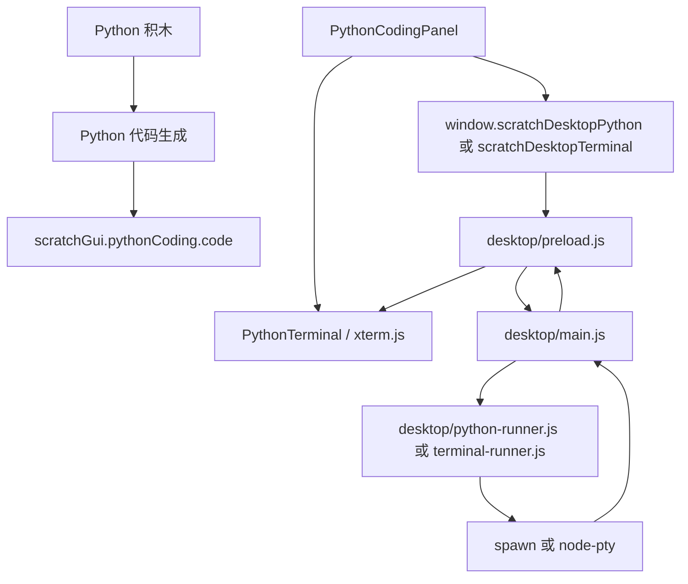

# 阶段 C：Python Terminal 产品化计划

本文是阶段 C 的实施前计划。

阶段 B 已经完成“积木生成 Python -> 写入 `main.py` -> Electron 主进程调用本机 Python -> 回传 stdout/stderr/exit code”。阶段 C 的目标是把当前 textarea 控制台升级成更接近 VS Code Terminal 的终端体验。

本阶段不要一次性把所有终端能力做满。推荐拆成 C1 和 C2：

```text
C1：xterm.js 输出终端
  -> 先替换 textarea
  -> 继续复用阶段 B 的 child_process.spawn
  -> 支持彩色输出、自动滚动、清屏、复制

C2：node-pty 交互式终端
  -> 引入原生模块 node-pty
  -> 支持 stdin、Ctrl+C、resize
  -> 每个 Tab 一个 PTY session
  -> 解决 Electron 打包和跨平台编译
```

## 当前结论

推荐先做 C1，再做 C2。

原因：

- `xterm.js` 是纯前端终端渲染器，接入风险低。
- 当前 `spawn` 已经能输出真实 Python 结果，足够驱动 xterm 的展示层。
- `node-pty` 是原生模块，会引入 Electron ABI、node-gyp、Windows 编译工具链、打包产物路径等风险。
- C1 做完后，用户能先看到“像 Terminal”的界面；C2 再补真正交互。

## 联网调研结论

### xterm.js

`xterm.js` 负责在浏览器页面里渲染终端。它本身不负责启动进程，也不直接访问系统 shell。

可用于阶段 C1：

- 显示 stdout/stderr。
- 支持 ANSI 颜色。
- 支持自动滚动。
- 支持复制终端文本。
- 配合 `@xterm/addon-fit` 根据容器尺寸自适应。

风险：

- 需要处理 React 生命周期，避免重复创建 terminal 实例。
- 需要在 Tab 切换、窗口 resize、左右布局变化时调用 fit。
- 要避免每次 Redux 更新都重建 Terminal。

参考：

- xterm.js 文档：<https://xtermjs.org/docs/>
- xterm.js npm 包：<https://www.npmjs.com/package/@xterm/xterm>
- fit addon：<https://www.npmjs.com/package/@xterm/addon-fit>

### node-pty

`node-pty` 负责创建伪终端。它能让程序获得接近真实 Terminal 的行为，例如 stdin、Ctrl+C、resize、交互式 shell。

可用于阶段 C2：

- 启动 Python 或系统 shell。
- 支持 `input()`。
- 支持用户在终端输入。
- 支持 Ctrl+C 中断。
- 支持 resize。

风险：

- `node-pty` 是原生模块，需要编译。
- Electron 使用自己的 Node/V8 ABI，普通 Node 编译产物可能不能直接用。
- Windows 需要处理编译工具链和 ConPTY/winpty 行为差异。
- 打包后需要确认 `.node` 原生二进制没有被错误放入 asar。

参考：

- node-pty 仓库：<https://github.com/microsoft/node-pty>
- Electron 原生模块文档：<https://www.electronjs.org/docs/latest/tutorial/using-native-node-modules>
- electron-builder 文件配置：<https://www.electron.build/configuration/contents>

### Electron IPC 和安全边界

终端能力仍然必须放在 Electron 主进程。

渲染进程只允许通过 preload 调用白名单 API：

```js
window.scratchDesktopTerminal = {
    start,
    input,
    resize,
    stop,
    clear,
    onData,
    onExit
};
```

不要暴露通用 `ipcRenderer.send`，也不要让 GUI 直接拿到 Node 的 `child_process`、`fs` 或 shell 能力。

参考：

- Electron IPC：<https://www.electronjs.org/docs/latest/tutorial/ipc>
- Electron Context Isolation：<https://www.electronjs.org/docs/latest/tutorial/context-isolation>

## 阶段 C 范围

### C1 做什么

1. 安装并接入 `@xterm/xterm`。
2. 安装并接入 `@xterm/addon-fit`。
3. 新增 `PythonTerminal` 展示组件。
4. 用 xterm 替换当前控制台 textarea。
5. 阶段 B 的 `python:output` 继续写入 xterm。
6. 阶段 B 的 `python:exit` 继续显示退出码。
7. 支持清屏。
8. 支持 resize 后自动 fit。
9. 保留当前 Run / Stop 按钮。

### C1 暂不做什么

1. 不支持用户在终端输入。
2. 不支持 `input()`。
3. 不支持 shell session。
4. 不引入 `node-pty`。
5. 不改变 Electron 打包配置。

### C2 做什么

1. 安装并接入 `node-pty`。
2. 新增 `desktop/terminal-runner.js`。
3. 每个代码模式 Tab 一个 terminal session。
4. 支持终端输入。
5. 支持 Ctrl+C。
6. 支持 resize。
7. 支持关闭 Tab 时销毁 PTY。
8. 调整 electron-builder，让原生 `.node` 文件正确打包。
9. 在 Windows/macOS/Linux 分别验证开发运行和生产打包。

### C2 暂不做什么

1. 不做 pip 依赖管理。
2. 不做 Python 虚拟环境 UI。
3. 不内置 Python 解释器。
4. 不做项目保存恢复。

这些放到后续阶段。

## 推荐架构



## 代码落点

### C1 前端

新增：

```text
packages/scratch-gui/src/components/python-terminal/python-terminal.jsx
packages/scratch-gui/src/components/python-terminal/python-terminal.css
```

职责：

- 创建 xterm Terminal 实例。
- 挂载 FitAddon。
- 接收 `lines` 或 imperative `write()`。
- 在容器尺寸变化时 fit。
- 暴露清屏能力。

调整：

```text
packages/scratch-gui/src/components/python-coding-panel/python-coding-panel.jsx
packages/scratch-gui/src/components/python-coding-panel/python-coding-panel.css
packages/scratch-gui/src/containers/python-coding-panel.jsx
packages/scratch-gui/src/reducers/python-coding.js
```

建议：

- 不要把 xterm 输出长期存在 Redux 里。
- Redux 保留运行状态、退出码、错误、脚本路径。
- 终端输出交给 `PythonTerminal` 内部维护，避免大量输出导致 Redux 重渲染。

### C2 桌面端

新增：

```text
desktop/terminal-runner.js
```

职责：

- 创建 PTY。
- 管理 tabId -> PTY session。
- 处理 input。
- 处理 resize。
- 处理 stop/kill。
- 向对应 editor webContents 回传 data/exit。

调整：

```text
desktop/main.js
desktop/preload.js
electron-builder.yml
package.json
package-lock.json
```

## IPC 设计

### C1 可复用阶段 B

继续使用：

```text
python:run
python:stop
python:status
python:output
python:exit
```

xterm 只是替换显示层。

### C2 新增 terminal API

建议新增独立命名空间，避免和阶段 B 的一次性运行混在一起：

```text
terminal:start
terminal:input
terminal:resize
terminal:stop
terminal:status
terminal:data
terminal:exit
```

preload 暴露：

```js
contextBridge.exposeInMainWorld('scratchDesktopTerminal', {
    start: options => ipcRenderer.invoke('terminal:start', options),
    input: data => ipcRenderer.invoke('terminal:input', data),
    resize: size => ipcRenderer.invoke('terminal:resize', size),
    stop: () => ipcRenderer.invoke('terminal:stop'),
    getStatus: () => ipcRenderer.invoke('terminal:status'),
    onData: handler => {
        const listener = (_event, payload) => handler(payload);
        ipcRenderer.on('terminal:data', listener);
        return () => ipcRenderer.removeListener('terminal:data', listener);
    },
    onExit: handler => {
        const listener = (_event, payload) => handler(payload);
        ipcRenderer.on('terminal:exit', listener);
        return () => ipcRenderer.removeListener('terminal:exit', listener);
    }
});
```

主进程仍然根据 `webContents.id -> tabId` 校验请求来源。

## C1 实施步骤

1. 安装依赖：

```powershell
npm install @xterm/xterm @xterm/addon-fit --workspace=packages/scratch-gui
```

2. 新增 `PythonTerminal` 组件。
3. 在 `PythonCodingPanel` 中替换 console textarea。
4. 容器收到 `python:output` 时写入 terminal。
5. 容器收到 `python:exit` 时写入退出提示。
6. 清屏按钮调用 terminal clear。
7. 验证开发模式。

## C2 实施步骤

1. 安装依赖：

```powershell
npm install node-pty --save
```

2. 确认本机能编译原生模块。
3. 新增 `desktop/terminal-runner.js`。
4. 注册 terminal IPC。
5. preload 暴露 `scratchDesktopTerminal`。
6. xterm 的 `onData` 转发到 `terminal:input`。
7. xterm resize 转发到 `terminal:resize`。
8. 关闭 Tab 时销毁 PTY。
9. 验证开发模式。
10. 验证 `npm run desktop:pack`。
11. 验证 `npm run desktop:dist`。

## 风险清单

| 风险 | 阶段 | 影响 | 应对 |
| - | - | - | - |
| xterm 重复创建实例 | C1 | 内存泄漏、输出重复 | React unmount 时 dispose |
| 输出量过大导致卡顿 | C1 | UI 卡顿 | 不把所有输出写 Redux，限制 scrollback |
| resize 不准确 | C1/C2 | 终端换行错乱 | 使用 FitAddon，并把 cols/rows 传给主进程 |
| node-pty 编译失败 | C2 | 无法安装或打包 | 先独立验证 Windows 开发机编译链 |
| `.node` 文件被 asar 包住 | C2 | 打包后启动失败 | 配置 asarUnpack 或 files |
| 多 Tab 输出串线 | C1/C2 | 输出出现在错误 Tab | 所有事件携带 tabId 并校验 sender |
| Ctrl+C 只杀前端状态 | C2 | 后台进程仍在跑 | 由 PTY session 处理 input 或 kill |

## 人工验证清单

### C1 验证

1. `npm run desktop`。
2. 首页新建代码模式。
3. 拖入 `print` 积木。
4. 点击 **Run**。
5. 预期：终端区域显示真实输出。
6. 拖入会抛异常的代码。
7. 预期：终端显示 traceback。
8. 点击 **Clear**。
9. 预期：终端清屏，运行状态不乱。
10. 调整窗口大小。
11. 预期：终端宽度自适应，没有文字遮挡。

### C2 验证

1. 运行包含 `input()` 的 Python 脚本。
2. 预期：能在终端输入内容并继续执行。
3. 运行长时间脚本。
4. 按 Ctrl+C。
5. 预期：Python 被中断。
6. 创建两个代码模式 Tab。
7. 两边分别运行脚本。
8. 预期：输出不串 Tab。
9. 关闭正在运行的 Tab。
10. 预期：对应 PTY 被销毁。
11. 执行 `npm run desktop:pack`。
12. 预期：打包版能启动终端。

## 推荐验收标准

C1 完成后可以认为“终端 UI 产品化初版”达标。

C2 完成后才可以认为“类 VS Code Terminal 能力”达标。

阶段 C 完成标志：

```text
代码模式下方不再是 textarea
终端显示真实 Python 输出
支持清屏、复制、自动滚动
支持输入、Ctrl+C、resize
多 Tab 终端互不串线
开发模式和打包模式都可用
```

## 建议先实施哪一部分

先实施 C1。

C1 改动小，能快速改善体验，也不会影响 Electron 打包稳定性。C1 验证通过后，再进入 C2 的 `node-pty` 原生模块接入。

## 2026-06-29 C1 实施记录

本轮已开始实施 C1：xterm 输出终端。

### 已实现

1. 安装 `@xterm/xterm` 和 `@xterm/addon-fit`。
2. 新增 `packages/scratch-gui/src/components/python-terminal/python-terminal.jsx`。
3. 新增 `packages/scratch-gui/src/components/python-terminal/python-terminal.css`。
4. 将 Python 编码面板下方控制台从 textarea 替换为 xterm。
5. 继续复用阶段 B 的 `python:run`、`python:output`、`python:exit`。
6. stdout 直接写入终端。
7. stderr 使用 ANSI 红色写入终端。
8. **Clear** 按钮改为清空 xterm 屏幕。
9. 终端使用 `FitAddon` 适配容器尺寸。

### 本轮仍未实现

1. 还不支持终端输入。
2. 还不支持 `input()`。
3. 还不支持 Ctrl+C 通过终端输入中断。
4. 还没有引入 `node-pty`。
5. 还没有新增 terminal IPC。

这些仍属于 C2。

### 本轮人工验证重点

1. 启动桌面端：

```powershell
fnm use 24
npm run desktop
```

2. 首页选择 **代码模式**。
3. 确认右侧下方控制台区域是黑色终端，不再是普通 textarea。
4. 拖入 `print` 积木，例如输出 `hello terminal`。
5. 点击 **Run**。
6. 预期：
   - 终端显示 `[python] Starting local Python...`；
   - 终端显示脚本路径；
   - 终端显示 `hello terminal`；
   - 状态栏显示退出码 `0`。
7. 拖入一个会报错的 Python 组合，或临时制造无效代码。
8. 点击 **Run**。
9. 预期：
   - 终端显示 traceback；
   - stderr 内容显示为红色；
   - 状态栏显示非 `0` 退出码。
10. 点击 **Clear**。
11. 预期：
    - 终端内容清空；
    - **Clear** 按钮变回不可用；
    - 代码区内容不丢失。
12. 拖入 `sleep` 类积木，运行后点击 **Stop**。
13. 预期：
    - 终端出现停止提示；
    - 状态不再显示运行中。
14. 调整桌面窗口宽度和高度。
15. 预期：
    - 终端宽度自适应；
    - 输出内容不遮挡按钮和状态栏；
    - 代码区和终端区没有重叠。
16. 新建第二个代码模式 Tab，各运行一次 `print`。
17. 预期：
    - 两个 Tab 的输出分别显示在各自终端；
    - 切换 Tab 时不出现明显白屏或异常。

## 2026-06-29 C2 实施记录

本轮开始实施 C2：`node-pty` 交互式终端。

### 已实现

1. 安装 `node-pty@1.1.0`。
2. 新增 `desktop/terminal-runner.js`。
3. Electron 主进程注册：
   - `terminal:startPython`
   - `terminal:input`
   - `terminal:resize`
   - `terminal:stop`
   - `terminal:status`
4. preload 暴露 `window.scratchDesktopTerminal`。
5. Python 编码面板优先使用 PTY 运行 Python。
6. xterm 输入会转发到 PTY。
7. xterm resize 会转发到 PTY。
8. 关闭 Tab 或窗口时会销毁对应 PTY。
9. electron-builder 增加 `asarUnpack`，避免 `node-pty` 原生模块被打包进 asar 后无法加载。
10. Windows 下 PTY 启动 Python 前，会先通过 `sys.executable` 反查真实 `python.exe` 路径，避免 `py -3` 这类短命令在 ConPTY 中报 `File not found`。
11. xterm 的输入和 resize 回调使用最新 React props，避免组件首次挂载时捕获 `isRunning=false`，导致运行后用户输入没有转发给 PTY。

### 当前观察

本机 Node 环境下，`node-pty` 可以成功启动 PowerShell 并输出 `pty-ok`。

补充验证：本机 Node 环境下已经成功通过 `TerminalRunner` 启动 Python 脚本，脚本包含 `input()`，向 PTY 写入 `hyj` 后返回 `hello hyj`，退出码为 `0`。该验证说明主进程侧的 PTY 输入、输出和解释器解析链路已经可用。

Windows 下测试 PTY 退出时，控制台额外打印过一次：

```text
AttachConsole failed
```

这来自 `node-pty` 的 Windows ConPTY helper。需要在 Electron 桌面端里继续观察：

- 是否只出现在独立 Node 验证脚本；
- 是否影响 Electron 内运行；
- 是否影响打包版。

### C2 人工验证重点

1. 运行包含 `input()` 的 Python 代码。
2. 预期：终端可输入内容，按 Enter 后 Python 继续执行。
3. 运行长时间脚本。
4. 在终端按 Ctrl+C。
5. 预期：Python 被中断，终端出现退出状态。
6. 调整窗口大小。
7. 预期：终端输出换行正常，输入光标位置正常。
8. 同时打开两个代码模式 Tab，各运行一个等待输入的脚本。
9. 预期：输入和输出不串 Tab。
10. 关闭正在运行的 Tab。
11. 预期：对应 PTY 被销毁，后台没有残留 Python。
12. 执行 `npm run desktop:pack`。
13. 预期：打包目录版本能启动，终端不报 `node-pty` 原生模块加载失败。
