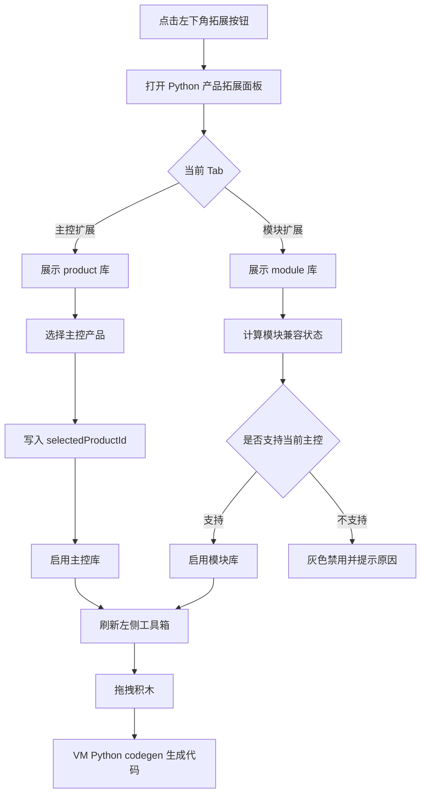

# 08 产品/模块式拓展面板执行方案

> 类型：产品形态调整 + 开发执行文档
> 背景：当前自定义拓展库已经能导入、注册、显示积木并参与 Python 代码生成，但入口放在 Python 顶部菜单的 **Manage Libraries**，产品形态更接近 Mixly 的独立库管理器。参考 Mind+ 竞品截图后，下一步应把“管理、导入、选择拓展库”收敛到 Scratch 原有 **拓展面板** 中，并支持“先选主控产品，再选该产品支持的模块拓展”。

---

## 1. 一句话目标

把 Python 模式的拓展面板改造成公司产品库入口：

```text
点击左下角拓展按钮
  -> 进入产品/模块式拓展面板
  -> 选择主控产品
  -> 再选择该主控支持的模块
  -> 支持的模块可加载，不支持的模块灰色禁用
  -> 加载后的积木出现在左侧工具箱，并参与 Python 代码生成
```

这次不是重写代码生成器，而是补齐拓展库的产品入口、兼容关系和启用状态。

---

## 2. 竞品截图拆解

截图里的核心体验可以拆成 6 层：

| 区域 | 行为 | 我们的对应方案 |
| - | - | - |
| 顶部橙色栏 | 返回、上传模式、主控扩展、模块扩展、搜索 | Python 拓展面板内做顶部导航，不再放到编辑器顶栏 |
| 主控扩展 Tab | 展示主板、机器人、套件等主产品 | `kind: "product"` 的拓展库卡片 |
| 模块扩展 Tab | 展示传感器、执行器、摄像头等模块 | `kind: "module"` 的拓展库卡片 |
| 高级筛选 | 官方库、已收藏、已加载、已下载 | 第一阶段保留官方/已加载/已安装/本地导入过滤 |
| 卡片状态 | 可选、下载、已选、灰色不可选 | 根据当前主控产品计算 `availability` |
| 搜索和排序 | 按名称、型号、标签筛选 | 复用搜索能力，必要时新写 Python 专用筛选条 |

关键差异是：Mind+ 不是把“库管理”作为单独工具，而是让用户在拓展面板里完成选择、下载、启用和禁用判断。

---

## 3. 当前实现现状

### 3.1 已有能力

当前项目已经具备这些基础：

| 能力 | 位置 |
| - | - |
| 打开 Scratch 拓展面板 | `packages/scratch-gui/src/containers/extension-library.jsx` |
| Scratch 通用库卡片组件 | `packages/scratch-gui/src/components/library/library.jsx` |
| Python 顶部菜单打开库管理器 | `packages/scratch-gui/src/components/menu-bar/python-menu-bar.jsx` |
| 独立库管理器弹窗 | `packages/scratch-gui/src/containers/library-manager.jsx` |
| 自定义拓展库 Redux 状态 | `packages/scratch-gui/src/reducers/custom-extensions.js` |
| `.json/.zip/.sbext` 解析 | `packages/scratch-gui/src/lib/custom-extension/package-reader.js` |
| manifest 规范化 | `packages/scratch-gui/src/lib/custom-extension/manifest-schema.js` |
| manifest 转 VM extension | `packages/scratch-gui/src/lib/custom-extension/manifest-to-extension.js` |
| Python 模板注册 | `packages/scratch-gui/src/lib/custom-extension/codegen-registry.js` |
| Python 代码生成 | `packages/scratch-vm/src/codegen/python.js` |

### 3.2 现在的问题

1. **入口不符合竞品习惯**：导入/管理在顶部菜单里，和用户“我要加拓展”的心智分离。
2. **产品和模块没有层级**：所有拓展库平铺在一起，不能表达“先选主控，再选模块”。
3. **兼容关系缺失**：不支持当前主控的模块没有灰色禁用，也没有原因提示。
4. **启用策略太粗**：当前导入的库基本都会参与工具箱展示，后续会导致积木分类越来越乱。
5. **管理和选择混在一起**：导入、删除、导出是管理动作；选择主控、启用模块是使用动作，需要在一个面板里分区呈现。

---

## 4. 产品交互方案

### 4.1 Python 模式拓展面板

Python 模式下点击左下角 **拓展** 按钮时，不再直接展示 Scratch 原始拓展卡片，而是展示公司产品式拓展面板。

```text
拓展面板
├── 顶部栏
│   ├── 返回
│   ├── 主控扩展
│   ├── 模块扩展
│   └── 搜索
├── 筛选栏
│   ├── 官方库
│   ├── 已安装
│   ├── 已加载
│   ├── 本地导入
│   └── 默认排序
└── 卡片网格
    ├── 主控产品卡片
    └── 模块拓展卡片
```

Scratch 舞台模式仍然使用原版拓展库，避免影响原有 Scratch 功能。

### 4.2 主控扩展

主控扩展代表一个产品或主板，例如：

- AI 机甲麦轮车
- Arduino Uno
- micro:bit
- 掌控板
- 公司后续机器人产品

用户选择主控后，系统写入当前编辑器的产品上下文：

```text
selectedProductId = "company-ai-mecanum"
```

这个上下文会影响 3 件事：

1. 模块扩展是否可选。
2. 左侧工具箱显示哪些主控积木。
3. Python 代码生成使用哪些初始化、运行库和启动入口。

### 4.3 模块扩展

模块扩展代表可叠加能力，例如：

- 蜂鸣器
- 超声波
- 巡线传感器
- 摄像头
- 舵机
- 串口通信

模块卡片需要根据当前主控计算状态：

| 状态 | UI | 点击行为 |
| - | - | - |
| 未选择主控 | 灰色 | 提示“请先选择主控扩展” |
| 支持当前主控 | 正常 | 加载模块拓展 |
| 不支持当前主控 | 灰色 | 提示“不支持当前主控：xxx” |
| 已加载 | 高亮/已加载标记 | 点击可定位到左侧积木分类，或保持已加载 |
| 缺少依赖 | 灰色 | 提示需要先安装/加载依赖 |

禁用卡片不能静默无反应。鼠标悬停和点击都要给出原因。

---

## 5. 数据模型调整

### 5.1 manifest 新增字段

在现有 v2 manifest 基础上增加产品/模块字段。

产品库示例：

```json
{
  "formatVersion": 2,
  "id": "company-ai-mecanum",
  "name": "AI 机甲麦轮车",
  "kind": "product",
  "target": "python",
  "vendor": "Company",
  "version": "1.0.0",
  "description": "AI 机甲麦轮车主控产品",
  "tags": ["robot", "mecanum"],
  "official": true,
  "hardware": {
    "productId": "company-ai-mecanum",
    "displayModel": "AI Mecanum",
    "uploadMode": "serial"
  }
}
```

模块库示例：

```json
{
  "formatVersion": 2,
  "id": "company-ultrasonic",
  "name": "超声波模块",
  "kind": "module",
  "target": "python",
  "vendor": "Company",
  "version": "1.0.0",
  "description": "读取距离并控制灯光",
  "tags": ["sensor"],
  "compatibility": {
    "products": ["company-ai-mecanum", "company-arduino-uno"],
    "requires": [],
    "reason": "该模块只支持带 I2C 接口的主控"
  }
}
```

### 5.2 Redux 状态建议

当前 `customExtensions.installedLibraries` 只表达“安装了哪些库”。后续需要补充“当前产品”和“启用模块”。

建议状态：

```js
{
    installedLibraries: [],
    selectedProductId: '',
    enabledLibraryIds: [],
    librarySources: []
}
```

字段含义：

| 字段 | 作用 |
| - | - |
| `installedLibraries` | 本地已导入/内置可用的库 |
| `selectedProductId` | 当前编辑器选择的主控产品 |
| `enabledLibraryIds` | 当前工作区启用的主控和模块库 |
| `librarySources` | 后续远程库、公司内置库、本地库来源 |

第一阶段可以先把 `selectedProductId` 和 `enabledLibraryIds` 持久化到 localStorage。后续如果要跟随 `.sb3` 项目保存，再接入项目元数据。

---

## 6. 兼容关系计算

新增一个纯函数模块：

```text
packages/scratch-gui/src/lib/custom-extension/compatibility.js
```

职责是根据当前产品、模块 manifest 和已启用库计算卡片状态。

```js
getLibraryAvailability({
    manifest,
    selectedProductId,
    enabledLibraryIds,
    installedLibraries
})
```

返回值建议：

```js
{
    enabled: false,
    selectable: false,
    status: 'unsupported-product',
    reason: '该模块不支持当前主控'
}
```

状态枚举：

| status | 含义 |
| - | - |
| `selectable` | 可以选择 |
| `no-product` | 模块需要先选择主控 |
| `unsupported-product` | 当前主控不支持该模块 |
| `missing-dependency` | 缺少依赖拓展 |
| `version-mismatch` | 版本不满足 |
| `enabled` | 已启用 |
| `installed` | 已安装但未启用 |

这个函数必须保持纯净，方便写 Jest 单元测试。

---

## 7. 代码落点

### 7.1 不建议直接大改原版 `LibraryComponent`

`LibraryComponent` 服务于角色库、背景库、声音库、Scratch 拓展库等多个页面。Mind+ 式产品面板需要更复杂的顶部 Tab、筛选、卡片状态和禁用原因。

建议新增 Python 专用组件：

```text
packages/scratch-gui/src/components/product-extension-library/
├── product-extension-library.jsx
├── product-extension-library.css
├── product-extension-card.jsx
└── product-extension-filter.jsx
```

容器：

```text
packages/scratch-gui/src/containers/product-extension-library.jsx
```

原有 `containers/extension-library.jsx` 只做路由：

```text
editorMode === "python"
  -> ProductExtensionLibrary
else
  -> 原 Scratch ExtensionLibrary
```

### 7.2 当前库管理器如何处理

保留当前能力，但迁移入口：

| 当前位置 | 后续处理 |
| - | - |
| Python 顶部菜单 **Manage Libraries** | 移除或隐藏 |
| `LibraryManager` 独立弹窗 | 复用导入、导出、删除逻辑 |
| 拓展面板内“高级筛选/管理” | 打开管理抽屉或内嵌管理区 |

推荐第一阶段不要删除 `LibraryManager`，先把打开入口从顶部菜单迁到拓展面板的 **管理/导入** 按钮。等新面板稳定后，再决定是否完全合并 UI。

### 7.3 工具箱注册策略

当前 Python 模式会把导入的自定义库注册进 VM，并刷新工具箱。后续需要改为：

```text
已安装库
  -> 根据 selectedProductId 和 enabledLibraryIds 过滤
  -> 只注册当前产品和已启用模块
  -> 刷新工具箱
```

落点：

```text
packages/scratch-gui/src/containers/blocks.jsx
```

重点方法：

```text
ensurePythonExtensions()
makePythonToolboxXML()
refreshToolboxXML()
```

---

## 8. 端到端流程



---

## 9. 分阶段实施

### 阶段 1：面板入口迁移

目标：Python 模式点击拓展按钮时进入新产品拓展面板。

开发内容：

1. 新增 `ProductExtensionLibrary` 容器和组件。
2. 在 `ExtensionLibrary` 容器中按 `editorMode` 分流。
3. 新面板先复用当前 `installedLibraries` 数据。
4. 顶部菜单中的 **Manage Libraries** 暂时保留，但标记为待迁移。

验收：

- 舞台模式拓展面板不变。
- Python 模式拓展面板显示主控/模块 Tab。
- 现有导入的 AI 机甲麦轮车库能在主控 Tab 出现。

### 阶段 2：产品/模块字段规范化

目标：导入库时能识别 `kind: product/module` 和兼容关系。

开发内容：

1. 扩展 `manifest-schema.js`。
2. 支持旧包默认 `kind: module` 或 `kind: product` 的兼容规则。
3. 示例包补充 `kind`、`compatibility.products`。
4. 文档补充用户如何写产品库和模块库。

验收：

- 产品卡片进入主控 Tab。
- 模块卡片进入模块 Tab。
- 缺少字段的旧 JSON 不会直接白屏，应给出可读错误。

### 阶段 3：兼容禁用状态

目标：模块能根据当前主控显示可选或灰色不可选。

开发内容：

1. 新增 `compatibility.js`。
2. 卡片支持 `disabled`、`reason`、`status`。
3. 鼠标悬停显示禁用原因。
4. 点击禁用卡片弹出提示，不关闭拓展面板。

验收：

- 未选择主控时，模块 Tab 的模块灰色。
- 选择 AI 机甲麦轮车后，支持它的模块可选。
- 不支持它的模块灰色，并能看到原因。

### 阶段 4：启用库影响工具箱

目标：只显示当前主控和已启用模块的积木。

开发内容：

1. Redux 增加 `selectedProductId` 和 `enabledLibraryIds`。
2. `blocks.jsx` 注册前过滤库。
3. 切换主控时提示是否清空不兼容模块。
4. 刷新工具箱后保持 Python 代码区正常更新。

验收：

- 选择主控后，左侧出现主控积木。
- 启用模块后，左侧新增模块积木分类。
- 未启用的模块不会出现在工具箱里。
- 切换主控后，不兼容模块从工具箱移除。

### 阶段 5：管理和导入内聚到面板

目标：导入、导出、删除库在拓展面板内完成。

开发内容：

1. 在新拓展面板增加 **导入库**、**管理库** 入口。
2. 复用 `LibraryManager` 的文件解析和持久化逻辑。
3. 管理区显示已安装、已加载、版本、来源。
4. 顶部菜单的 **Manage Libraries** 移除或隐藏。

验收：

- 用户不用离开拓展面板即可导入 `.json/.zip/.sbext`。
- 导入后新库立即出现在主控或模块 Tab。
- 删除库后工具箱同步刷新。

---

## 10. 测试用例

### 10.1 单元测试

建议新增：

```text
packages/scratch-gui/src/lib/custom-extension/compatibility.test.js
```

覆盖：

| 用例 | 期望 |
| - | - |
| 未选择主控时模块不可选 | `status = no-product` |
| 模块支持当前主控 | `status = selectable` |
| 模块不支持当前主控 | `status = unsupported-product` |
| 模块缺少依赖 | `status = missing-dependency` |
| 已启用模块 | `status = enabled` |

### 10.2 人工验证

准备 3 个测试包：

| 包 | 类型 | 用途 |
| - | - | - |
| AI 机甲麦轮车 | product | 当前主控 |
| 超声波模块 | module | 支持 AI 机甲麦轮车 |
| 掌控板专用 OLED | module | 不支持 AI 机甲麦轮车 |

验证步骤：

1. 启动桌面端，进入 Python 编码模式。
2. 点击左下角拓展按钮。
3. 在 **主控扩展** 里选择 AI 机甲麦轮车。
4. 切到 **模块扩展**。
5. 确认超声波模块可选。
6. 确认 OLED 模块灰色不可选，并显示不支持原因。
7. 启用超声波模块。
8. 关闭拓展面板。
9. 确认左侧工具箱出现 AI 机甲麦轮车和超声波模块分类。
10. 拖拽积木，确认 Python 代码区能生成对应代码。

---

## 11. 风险和取舍

| 风险 | 说明 | 处理 |
| - | - | - |
| 原版 `LibraryComponent` 复用困难 | 它是通用库组件，不适合复杂产品状态 | 新建 Python 专用面板 |
| 启用状态和项目保存关系不清 | 当前先存在 localStorage，后续可能要跟 `.sb3` 项目走 | 第一阶段先做本地状态，后续接项目元数据 |
| 切换主控会影响已有积木 | 不兼容模块可能已经在画布中使用 | 切换前提示，并保留积木但标记生成风险 |
| 远程下载库暂未实现 | 截图里有下载按钮，我们当前先支持本地导入 | 第一阶段下载按钮可以作为状态占位 |
| 代码生成依赖库启用顺序 | 主控和模块都可能写 imports/setup | 继续使用 VM codegen 的 imports/variables/setups 合并机制 |

---

## 12. 推荐结论

下一步不要继续强化顶部菜单里的库管理器。更合适的路线是：

1. **拓展按钮进入产品式拓展面板**。
2. **主控产品和模块拓展分 Tab 展示**。
3. **选择主控后再计算模块兼容状态**。
4. **只有当前产品和已启用模块进入工具箱**。
5. **导入/管理库作为拓展面板里的功能，不再作为顶部菜单主入口**。

这样更接近 Mind+ 的使用心智，也能解决当前“所有自定义库混在一起”的问题。
