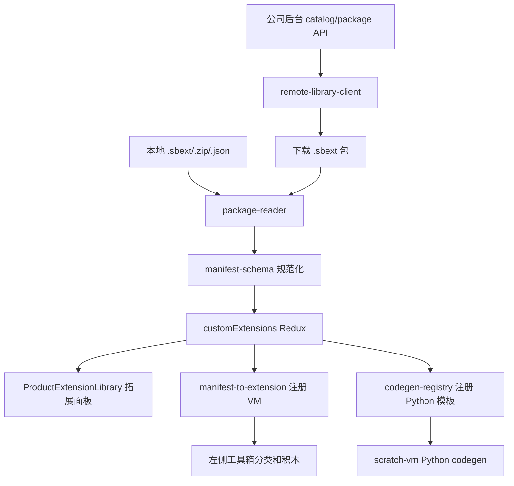

# 09 MakeCode-like 云端拓展库框架方案

> 类型：云端拓展库 + 本地拓展库统一框架
> 背景：当前项目已经基本支持本地 `.json/.zip/.sbext` 拓展库导入。新的产品要求是参考 Microsoft MakeCode：用户可以上传拓展库到公司后台，编辑器从后台直接加载代码积木拓展库；同时继续支持本地导入。目标是先搭好稳定框架，后续主要维护拓展包文件和后台目录，不频繁改编辑器源码。

---

## 1. MakeCode 参考结论

MakeCode 的扩展机制有几个关键点值得借鉴：

| MakeCode 做法 | 对我们的启发 |
| - | - |
| 扩展是动态/静态库机制，可以扩展某个 target | 我们的拓展库要绑定 Python 模式、主控产品和模块能力 |
| 用户在 Extensions 面板选择扩展后，会新增一个积木分类 | 我们也要从拓展面板选择后刷新左侧工具箱 |
| 动态扩展可以从 GitHub 加载、编译并纳入 Web App | 我们可以从公司后台下载 `.sbext`，解析后注册到 VM 和 Python codegen |
| 可搜索扩展需要审批，禁用扩展不能加载 | 我们需要后台审核、上下架、禁用和灰度机制 |
| 扩展由 `pxt.json` 描述，包含文件、依赖、版本等信息 | 我们的 `.sbext` 需要稳定 manifest，描述 blocks、generator、runtime、依赖和兼容关系 |
| 项目引用扩展时会锁定具体版本，更新需要用户显式操作 | 我们保存项目时也应记录拓展库 id、version、source 和 checksum |

参考资料：

- [MakeCode extensions](https://makecode.com/extensions)
- [Building your own extension](https://makecode.com/extensions/getting-started)
- [pxt.json Manual Page](https://makecode.com/extensions/pxt-json)
- [Extension Approval](https://makecode.com/extensions/approval)
- [Extension Versioning](https://makecode.com/extensions/versioning)

---

## 2. 一句话目标

建立一个“本地导入 + 云端目录 + 版本锁定 + 审核发布”的统一拓展库框架：

```text
本地 .sbext 文件
    \
     -> 统一 package reader -> manifest -> VM 注册 -> 工具箱积木 -> Python codegen
    /
公司后台拓展库目录
```

编辑器不关心拓展库来自本地还是后台。只要最后变成统一 manifest，就走同一条注册和生成链路。

---

## 3. 产品形态

### 3.1 用户视角

用户在 Python 模式点击左下角 **拓展**：

```text
拓展面板
├── 主控扩展
├── 模块扩展
├── 搜索
├── 筛选：官方 / 已安装 / 已加载 / 本地 / 云端
├── 导入本地拓展库
└── 上传拓展库
```

卡片来源可以分为：

| 来源 | 说明 |
| - | - |
| 内置 | 随编辑器打包，离线可用 |
| 云端 | 公司后台审核通过的拓展库 |
| 本地 | 用户从磁盘导入的 `.json/.zip/.sbext` |
| 草稿 | 用户上传后但未审核通过的个人/组织可见拓展 |

### 3.2 管理员/产品人员视角

后台需要支持：

1. 上传拓展包。
2. 自动校验 manifest 和包结构。
3. 预览卡片、积木、Python 生成结果。
4. 提交审核。
5. 审核通过后上架到云端目录。
6. 下架、禁用、灰度、版本回滚。

核心目标是：后续新增产品或模块时，尽量只维护拓展包和后台配置，不改前端业务代码。

---

## 4. 总体架构



设计原则：

1. **来源解耦**：本地文件和云端文件都先变成同一种 `.sbext` 包。
2. **注册复用**：不为云端拓展另写一套 VM 注册逻辑。
3. **生成复用**：不为云端拓展另写一套 Python codegen。
4. **审核优先**：普通用户不能加载被禁用或未通过审核的公开拓展。
5. **版本可追溯**：项目保存时记录拓展库版本，避免远程更新导致旧项目变坏。

---

## 5. 后台数据模型

### 5.1 拓展库记录

```json
{
  "id": "company-ai-mecanum",
  "name": "AI 机甲麦轮车",
  "kind": "product",
  "target": "python",
  "vendor": "Company",
  "description": "AI 机甲麦轮车主控产品",
  "tags": ["robot", "mecanum"],
  "visibility": "public",
  "status": "approved",
  "latestVersion": "1.0.3",
  "iconUrl": "https://cdn.example.com/extensions/company-ai-mecanum/icon.png",
  "updatedAt": "2026-07-06T00:00:00Z"
}
```

### 5.2 版本记录

```json
{
  "extensionId": "company-ai-mecanum",
  "version": "1.0.3",
  "status": "approved",
  "packageUrl": "https://cdn.example.com/extensions/company-ai-mecanum/1.0.3/package.sbext",
  "manifestUrl": "https://cdn.example.com/extensions/company-ai-mecanum/1.0.3/manifest.json",
  "sha256": "PACKAGE_SHA256",
  "size": 48213,
  "compatibility": {
    "products": [],
    "editor": ">=14.1.0"
  },
  "review": {
    "reviewer": "admin",
    "reviewedAt": "2026-07-06T00:00:00Z"
  }
}
```

### 5.3 状态枚举

| status | 含义 | 是否可被普通用户加载 |
| - | - | - |
| `draft` | 上传草稿 | 否，仅作者可见 |
| `reviewing` | 待审核 | 否 |
| `approved` | 审核通过 | 是 |
| `rejected` | 审核拒绝 | 否 |
| `disabled` | 已禁用 | 否，已安装项目也应提示风险 |
| `deprecated` | 已废弃 | 可加载，但提示建议升级 |

---

## 6. 后台 API 草案

### 6.1 查询目录

```http
GET /api/extensions/catalog?target=python&kind=module&productId=company-ai-mecanum&q=ultra&page=1
```

返回卡片列表，不直接返回完整包。

```json
{
  "items": [
    {
      "id": "company-ultrasonic",
      "name": "超声波模块",
      "kind": "module",
      "version": "1.0.0",
      "status": "approved",
      "source": "cloud",
      "iconUrl": "https://cdn.example.com/extensions/company-ultrasonic/icon.png",
      "compatibility": {
        "products": ["company-ai-mecanum"]
      }
    }
  ],
  "total": 1
}
```

### 6.2 下载指定版本

```http
GET /api/extensions/company-ultrasonic/versions/1.0.0/package
```

返回 `.sbext` 文件。

### 6.3 上传拓展包

```http
POST /api/extensions/upload
Content-Type: multipart/form-data
```

请求字段：

| 字段 | 说明 |
| - | - |
| `file` | `.sbext` / `.zip` / `.json` |
| `visibility` | `private` / `organization` / `public` |
| `notes` | 上传说明 |

后台处理：

1. 解压或读取文件。
2. 校验 manifest。
3. 生成卡片预览。
4. 存储包文件和图标。
5. 进入 `draft` 或 `reviewing` 状态。

### 6.4 提交审核

```http
POST /api/extensions/{id}/versions/{version}/submit-review
```

### 6.5 禁用版本

```http
PATCH /api/extensions/{id}/versions/{version}
```

```json
{
  "status": "disabled",
  "reason": "存在错误的 Python 初始化代码"
}
```

---

## 7. 前端框架改造

### 7.1 新增远程源抽象

建议新增：

```text
packages/scratch-gui/src/lib/custom-extension/
├── library-sources.js
├── remote-library-client.js
├── remote-library-cache.js
└── upload-library-package.js
```

职责：

| 文件 | 职责 |
| - | - |
| `library-sources.js` | 统一描述内置、本地、云端三类来源 |
| `remote-library-client.js` | 请求后台 catalog、manifest、package |
| `remote-library-cache.js` | 缓存已下载包，支持离线再次加载 |
| `upload-library-package.js` | 上传本地包到后台 |

### 7.2 Redux 状态扩展

建议扩展 `custom-extensions.js`：

```js
{
    installedLibraries: [],
    remoteCatalog: [],
    remoteCatalogStatus: 'idle',
    selectedProductId: '',
    enabledLibraryIds: [],
    packageCache: {},
    uploadTasks: []
}
```

状态含义：

| 字段 | 说明 |
| - | - |
| `remoteCatalog` | 后台返回的卡片目录 |
| `remoteCatalogStatus` | `idle/loading/succeeded/failed` |
| `packageCache` | 已下载版本的本地缓存索引 |
| `uploadTasks` | 上传进度、错误和结果 |

### 7.3 面板加载流程

```text
打开拓展面板
  -> 读取本地 installedLibraries
  -> 请求后台 catalog
  -> 合并本地和云端卡片
  -> 根据 selectedProductId 计算可用状态
  -> 用户点击云端卡片
  -> 下载 package.sbext
  -> 校验 sha256
  -> package-reader 解析
  -> manifest-schema 规范化
  -> installCustomExtensionLibrary
  -> ensurePythonExtensions 刷新工具箱
```

本地导入仍走已有 `package-reader.js`，只是入口迁到拓展面板内。

---

## 8. 拓展包格式补充

为了支撑云端维护，`.sbext` 推荐固定结构：

```text
package.sbext
├── manifest.json
├── blocks.json
├── generator/
│   └── python.json
├── libraries/
│   └── *.py
├── media/
│   └── icon.png
└── docs/
    └── README.md
```

云端场景新增 manifest 字段：

```json
{
  "formatVersion": 2,
  "id": "company-ultrasonic",
  "version": "1.0.0",
  "source": {
    "type": "cloud",
    "registry": "company",
    "packageId": "company-ultrasonic",
    "checksum": "PACKAGE_SHA256"
  },
  "compatibility": {
    "products": ["company-ai-mecanum"],
    "editor": ">=14.1.0"
  },
  "review": {
    "status": "approved"
  }
}
```

---

## 9. 安全和审核策略

第一阶段建议只允许声明式拓展包，不允许普通用户上传任意 JS 执行代码。

| 风险 | 处理 |
| - | - |
| 恶意 JS | 普通包只允许 JSON manifest + Python 模板，不执行上传者 JS |
| 恶意 Python 运行库 | 后台审核，展示库文件 diff，必要时只允许官方账号发布 |
| 包被篡改 | 下载后校验 `sha256` |
| 版本破坏旧项目 | 项目锁定版本，更新需要用户确认 |
| 后台下架 | 已安装项目可继续使用缓存，但提示该版本已下架/禁用 |
| 包过大 | 后台限制大小，建议图标和文档资源走 CDN |

MakeCode 对可搜索扩展采用审批机制，并明确禁用扩展不能加载。我们也应保留“审核通过才公开展示、禁用版本不能新加载”的底线。

---

## 10. 项目保存和版本锁定

项目中需要记录已用拓展库：

```json
{
  "extensionLibraries": [
    {
      "id": "company-ai-mecanum",
      "version": "1.0.3",
      "source": "cloud",
      "registry": "company",
      "sha256": "PACKAGE_SHA256"
    },
    {
      "id": "local-demo",
      "version": "0.1.0",
      "source": "local"
    }
  ]
}
```

加载项目时：

1. 优先从本地缓存找指定版本。
2. 找不到则向后台请求指定版本。
3. 后台版本被禁用时，提示用户风险。
4. 用户可以选择继续加载缓存、升级到新版本或移除拓展。

这个设计能避免“云端拓展更新后，旧项目突然生成不同代码”的问题。

---

## 11. 分阶段实施

### 阶段 1：源抽象和面板占位

目标：先把本地、内置、云端统一成 source/card 模型。

开发内容：

1. 新增 `library-sources.js`。
2. 拓展面板支持 `source: builtin/local/cloud`。
3. 本地导入仍走已有逻辑。
4. 云端先用 mock catalog 数据。

验收：

- 本地导入卡片显示为“本地”。
- mock 云端卡片显示为“云端”。
- 点击本地库仍能加载积木。

### 阶段 2：只读云端目录

目标：编辑器能从后台读取拓展目录。

开发内容：

1. 实现 `remote-library-client.js`。
2. 接入 `GET /api/extensions/catalog`。
3. 支持搜索、主控/模块过滤、官方/已加载过滤。
4. 网络失败时显示可恢复错误，不影响本地导入。

验收：

- 断网时本地库仍可用。
- 有网时能看到后台返回的拓展卡片。
- 不支持当前主控的云端模块灰色不可选。

### 阶段 3：云端下载并安装

目标：点击云端卡片后下载 `.sbext`，并走现有安装链路。

开发内容：

1. 下载 `package.sbext`。
2. 校验 `sha256`。
3. 复用 `package-reader.js`。
4. 安装后写入 `installedLibraries`。
5. 刷新工具箱和 Python codegen。

验收：

- 云端库加载后和本地库表现一致。
- 下载失败有错误提示。
- checksum 不匹配时拒绝安装。

### 阶段 4：上传拓展库

目标：用户可以从拓展面板上传本地包到后台。

开发内容：

1. 面板增加 **上传拓展库**。
2. 实现 `upload-library-package.js`。
3. 上传前本地预校验 manifest。
4. 上传后显示审核状态。

验收：

- 合法 `.sbext` 可上传。
- 非法包上传前被拦截。
- 上传成功后进入草稿/审核状态。

### 阶段 5：审核、版本和项目锁定

目标：接近 MakeCode 的可维护扩展生态。

开发内容：

1. 支持 `approved/disabled/deprecated` 状态。
2. 保存项目时记录拓展库版本。
3. 加载项目时按版本恢复拓展库。
4. 支持显式升级拓展库版本。

验收：

- 旧项目加载固定版本。
- 新版本不会自动改变旧项目行为。
- 被禁用版本有明显提示。

---

## 12. 后续维护方式

框架搭好后，新增一个公司产品或模块的理想流程是：

```text
产品人员/开发人员
  -> 编写拓展包目录
  -> 本地预览和测试
  -> 打包 .sbext
  -> 上传到公司后台
  -> 后台校验和审核
  -> 上架
  -> 编辑器拓展面板自动出现卡片
```

前端后续只维护：

1. 拓展面板 UI。
2. 包格式兼容。
3. VM 注册和 Python codegen 框架。
4. 云端 API 对接。

具体产品能力尽量沉淀在 `.sbext` 包中，而不是继续把每个机器人产品写进编辑器源码。

---

## 13. 推荐结论

建议把拓展库产品化拆成两条线并行：

1. **08 文档的产品/模块面板**：解决用户怎么选主控、怎么选模块、怎么禁用不兼容模块。
2. **本方案的云端拓展库框架**：解决拓展从哪里来、怎么上传、怎么审核、怎么按版本加载。

这两条线合起来，才能达到“后续维护拓展文件即可扩展产品”的目标。
